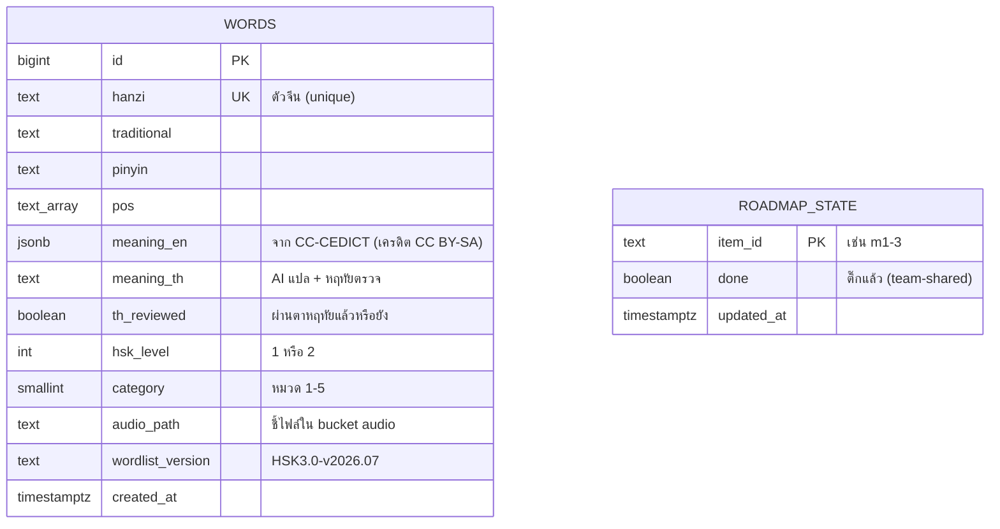
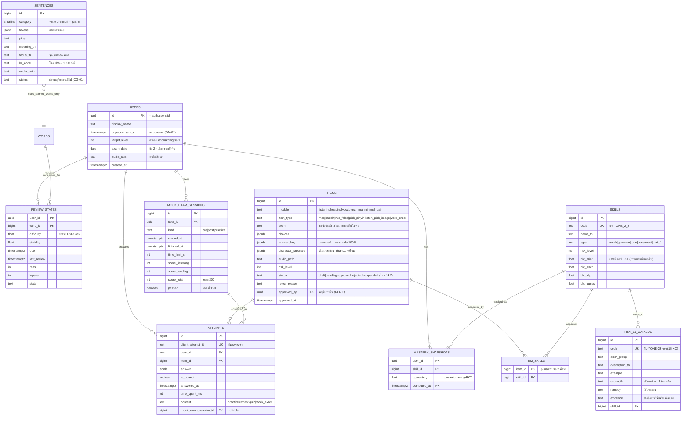

# 🗄️ Database + ER Diagram — 星航

> การบ้านอาจารย์นัดรอบ 4 (13 ส.ค.): "คราวหน้าขอดูพวก database, ER" · อัปเดต 14 ส.ค. 2026
> หลักความซื่อตรงของทีม: แยกชัดว่าอะไร**มีจริงวันนี้** (ดึงจาก Supabase จริง ไม่ได้วาดจากความจำ) อะไรคือ**พิมพ์เขียวที่จะเกิดเมื่อมีล็อกอิน** (m7-1)
> ผัง mermaid — เปิดบน GitHub หรือ Obsidian (vault `docs/`) เห็นเป็นแผนภาพ

---

## 1) ที่ใช้จริงวันนี้ (production ณ 14 ส.ค.)

ยังไม่มีล็อกอิน → ฐานข้อมูลกลางเก็บเฉพาะ **เนื้อหา** ส่วน**ข้อมูลรายผู้เรียน**อยู่ในเครื่องของแต่ละคน (localStorage) ตามแผน แล้วค่อยยกขึ้น DB ตอน m7-1

### 1.1 Supabase (PostgreSQL) — 2 ตาราง + 1 storage bucket

- **words** — คลังคำ HSK1 ครบ 300 แถว (แปลไทยตรวจแล้ว 300/300 · หมวดครบ · เสียงครบ)
- **roadmap_state** — สถานะติ๊กหน้า /roadmap ของทีม (⚠️ RO-04: ตอนนี้เขียนได้ทุกคน — จะล็อกเป็น admin-only ตอนมี Auth)
- **Storage bucket `audio`** — ไฟล์เสียง edge-tts 300 ไฟล์ (`words/{id}.mp3`) — client cache ผ่าน Serwist ให้ฟังออฟไลน์ได้ (แผน OF)

### 1.2 ฝั่งเครื่องผู้เรียน (localStorage — "ตารางชั่วคราว" ก่อนมีบัญชี)

| กล่อง (key) | เก็บอะไร | จะย้ายไปตารางไหนตอน m7-1 |
|---|---|---|
| `jrj_fsrs_cards_v1` | การ์ดทวน FSRS ต่อคำ (difficulty/stability/due/state) | `review_states` |
| `jrj_practice_rounds` | รอบฝึก (โหมด ฟัง/อ่าน/เรียงประโยค/จับคู่ · ถูก/ทั้งหมด · เวลา) | `attempts` (สรุประดับรอบ → จะเก็บละเอียดรายข้อแทน) |
| `jrj_quiz_attempts` | ควิซท้ายหมวดทุกครั้ง **รายข้อ** (ทักษะ/ข้อไหน/ถูก-ผิด) — วัตถุดิบ BKT | `attempts` (+ context) |
| `jrj_daily_learn` | คำใหม่ที่เริ่มเรียนวันนี้ (เป้า 10 คำ/วัน — ON-06) | `review_states.created_at` อนุมานได้ / คอลัมน์สรุปรายวัน |
| `xh_pretest_v1` | ผลแบบทดสอบก่อนเรียน (คะแนนฐาน pre) | `mock_exam_sessions` (kind=pre) |
| `jrj_audio_rate` | ค่าตั้งเสียงช้า 0.75x | `users` (คอลัมน์ตั้งค่า) |

---

## 2) พิมพ์เขียวเต็มเมื่อมีล็อกอิน (m7-1 เป็นต้นไป — ตาม ARCHITECTURE §4)

### ความสัมพันธ์อ่านเป็นภาษาคน
- ผู้เรียน 1 คน → ตอบได้หลาย `attempts` (ทุกการตอบ 1 ข้อ = 1 แถว — **append-only ห้ามแก้/ลบ** เพราะเป็น dataset เทรน pyBKT)
- ข้อสอบ 1 ข้อ ↔ วัดได้หลายทักษะ ผ่าน `item_skills` = **Q-matrix** (ไม่มีตารางนี้ BKT ไม่รู้จะอัปเดตทักษะไหน)
- `thai_l1_catalog` (จุดผิดคนไทย 15 KC) โยงเข้า `skills` → ตัวลวงข้อสอบอ้างอิงได้ว่าดักจุดผิดไหน
- `mock_exam_sessions.kind` = pre|post|practice → คะแนน pre/post รายคนคือหลักฐาน gain score ของงานวิจัย

### นโยบายความปลอดภัย (RLS) — สรุป
- ตารางรายผู้ใช้ (`attempts`, `review_states`, `mastery_snapshots`, `mock_exam_sessions`, `users`): เปิด RLS `user_id = auth.uid()` — เห็น/เพิ่มของตัวเองเท่านั้น · `attempts` ไม่ให้ UPDATE/DELETE เชิง policy
- ตารางเนื้อหา (`words`, `skills`, `items`, `item_skills`, `thai_l1_catalog`): อ่านสาธารณะ เขียนได้เฉพาะ service role (ผ่านหน้า Admin m7-2/7-3)
- **`answer_key`:** ข้อฝึก/ทวนเสิร์ฟพร้อมเฉลยได้ (ตรวจออฟไลน์) · ข้อ **mock เสิร์ฟแบบตัดเฉลยออก** ตรวจฝั่ง server เท่านั้น — กัน pre/post ปนเปื้อน (PL-07)

---

### ปรับ 14 ส.ค. (หลังไล่ตรวจเทียบมติล่าสุด — พิมพ์เขียวเดิมตามไม่ทัน 4 จุด)
1. `items.reviewed_by_human (boolean)` → **`status` 5 สถานะ** ตามวงจรโฟลว์แอดมิน 4.2 (ร่าง→รออนุมัติ→อนุมัติ→ตีกลับ→ระงับ) + `approved_by` บังคับ RO-03 เชิงข้อมูล
2. `users` เพิ่ม `target_level`, `exam_date` (เก็บคำตอบ onboarding ①②) + `audio_rate`
3. `words` เพิ่ม `image_path` (รูปประกอบ — แผน C5) และ `etymology_*` (การ์ดที่มาอักษร m1-7)
4. เพิ่มตาราง **`sentences`** — ประโยคตัวอย่าง/เรียงคำเป็น "เนื้อหาเรียน" คนละชนิดกับ `items` ที่เป็นข้อสอบ (ตอนนี้อยู่ใน sentences.ts — จะยกขึ้นตารางนี้)

## 3) ลำดับการเกิดของตาราง (ผูกกับ roadmap)

| เฟส | ตารางที่เพิ่ม | งาน roadmap |
|---|---|---|
| ✅ ตอนนี้ | `words`, `roadmap_state`, bucket `audio` | m1-1/1-2 (เสร็จแล้ว) |
| m7-1 ล็อกอิน | `users` (+ RLS ทุกตาราง + ปิดช่อง RO-04) | คิวถัดไปฝั่งโค้ด |
| m3-2 log ขึ้นฐาน | `attempts` + ย้ายข้อมูล localStorage ขึ้นบัญชี | ต่อจาก m7-1 ทันที |
| m7-3 item bank | `items`, `item_skills`, `skills` | ตะวันป้อนข้อสอบผ่านหน้า Admin |
| m5 mock/pre-post | `mock_exam_sessions` | หลัง item bank มีข้อ |
| m8 BKT | `mastery_snapshots`, `thai_l1_catalog` (ยกจาก catalog-v1.json ที่ร่างแล้ว) | ก.ย. |
| m4-3 sync ทวน | `review_states` | พร้อม m7-1 |
