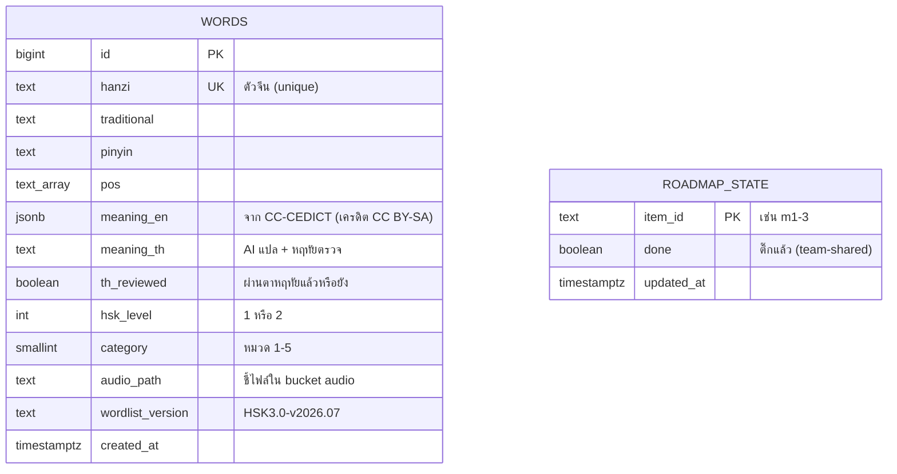

# 🗄️ Database + ER Diagram — 星航

> การบ้านอาจารย์นัดรอบ 4 (13 ส.ค.): "คราวหน้าขอดูพวก database, ER" · อัปเดต **21 ส.ค. 2026** (รอบไล่ requirement → entity · ดู changelog ท้ายหัวข้อ 2)
> 📖 **อ่านไม่ไหว/หาที่จับไม่ได้ → เริ่มที่ [`ER-ฉบับย่อ-หัวตารางและคีย์.md`](ER-ฉบับย่อ-หัวตารางและคีย์.md)** (หัวตาราง+คีย์ เรียงตามกระบวนการผู้ใช้ ตามที่อาจารย์สั่งนัดรอบ 5) แล้วค่อยกลับมาอ่านไฟล์นี้เอารายละเอียด
>
> **ไฟล์นี้คือแหล่งจริงแหล่งเดียวของ data model** — ถ้า `ARCHITECTURE.md` §4 ขัดกับไฟล์นี้ ให้ยึดไฟล์นี้
> 📥 **ที่มาของ entity ทุกตัวในผังนี้:** [`ความต้องการข้อมูล-User-Journey.md`](ความต้องการข้อมูล-User-Journey.md) (ขั้น 0 — เดินเส้นทางผู้เรียนแล้วไล่ว่าทุกก้าวต้องจำอะไร) · ไฟล์นั้นยังมีเช็กลิสต์ "คำถามที่ฐานข้อมูลต้องตอบได้" ไว้ใช้ตรวจตอนขั้น 5
>
> 🔁 **ลำดับความจริงของ schema:** [`er-drawio.sql`](er-drawio.sql) = **ต้นทางเดียว** → ผังทั้งสองแบบสร้างอัตโนมัติด้วย `python scripts/gen_er_diagrams.py`
> ① `ER-星航.drawio` (เปิดใน draw.io / ใส่เล่ม) · ② ผัง mermaid ในหัวข้อ 2 ข้างล่าง (เห็นบน GitHub/Obsidian)
> **แก้ schema ที่ไฟล์ `.sql` เสมอ แล้วรันสคริปต์ใหม่** — อย่าแก้กล่องในผังแล้วหวังว่า `.sql` จะตามมาเอง (จะกลับไปเป็นปัญหาเดิมคือผังกับ DDL ไม่ตรงกัน แบบที่ไล่ตรวจเจอ 6 จุดเมื่อ 20 ส.ค.)
> คำอธิบายรายคอลัมน์ในผัง mermaid ดึงมาจากคอมเมนต์ท้ายบรรทัดใน `.sql` โดยตรง — เขียนเหตุผลไว้ที่ SQL ที่เดียว แล้วมันไหลไปทุกผังเอง
> ⚠️ จัดเลย์เอาต์ใน draw.io ได้ตามสบาย แต่ถ้า generate ใหม่ เลย์เอาต์จะถูกเขียนทับ (จัดหลังสุดเสมอ)
> หลักความซื่อตรงของทีม: แยกชัดว่าอะไร**มีจริงวันนี้** (ดึงจาก Supabase จริง ไม่ได้วาดจากความจำ) อะไรคือ**พิมพ์เขียวที่จะเกิดเมื่อมีล็อกอิน** (m7-1)
> ผัง mermaid — เปิดบน GitHub หรือ Obsidian (vault `docs/`) เห็นเป็นแผนภาพ

---

## 1) ที่ใช้จริงวันนี้ (production ณ 14 ส.ค.)

ยังไม่มีล็อกอิน → ฐานข้อมูลกลางเก็บเฉพาะ **เนื้อหา** ส่วน**ข้อมูลรายผู้เรียน**อยู่ในเครื่องของแต่ละคน (localStorage) ตามแผน แล้วค่อยยกขึ้น DB ตอน m7-1

### 1.1 Supabase (PostgreSQL) — 2 ตาราง + 1 storage bucket



- **words** — คลังคำ HSK1 ครบ 300 แถว (แปลไทยตรวจแล้ว 300/300 · หมวดครบ · เสียงครบ)
  - ⚠️ **ยังไม่มีใน DB จริง** (อยู่ในพิมพ์เขียวเท่านั้น): `image_path` (แผน C5), `etymology_image_path` + `etymology_story_th` (แผน m1-7) — migration ล่าสุดที่รันแล้วคือ `data/seeds/004_add_category.sql` · ผัง mermaid ข้างบนจึงไม่แสดง 3 คอลัมน์นี้ ส่วน `er-drawio.sql` แสดงไว้แต่ติดป้าย `(แผน …)` กำกับ
- **roadmap_state** — สถานะติ๊กหน้า /roadmap ของทีม (⚠️ RO-04: ตอนนี้เขียนได้ทุกคน — จะล็อกเป็น admin-only ตอนมี Auth)
- **Storage bucket `audio`** — ไฟล์เสียง edge-tts 300 ไฟล์ (`words/{id}.mp3`) — client cache ผ่าน Serwist ให้ฟังออฟไลน์ได้ (แผน OF)

### 1.2 ฝั่งเครื่องผู้เรียน (localStorage — "ตารางชั่วคราว" ก่อนมีบัญชี)

| กล่อง (key) | เก็บอะไร | จะย้ายไปตารางไหนตอน m7-1 |
|---|---|---|
| `jrj_fsrs_cards_v1` | การ์ดทวน FSRS ต่อคำ (difficulty/stability/due/state) | `review_states` |
| `jrj_practice_rounds` | รอบฝึก (โหมด ฟัง/อ่าน/เรียงประโยค/จับคู่ · ถูก/ทั้งหมด · เวลา) | `sessions` (kind=practice, mode=…) + `attempts` รายข้อ |
| `jrj_quiz_attempts` | ควิซท้ายหมวดทุกครั้ง **รายข้อ** (ทักษะ/ข้อไหน/ถูก-ผิด) — วัตถุดิบ BKT | `sessions` (kind=quiz, attempt_no) + `attempts` |
| `jrj_daily_learn` | คำใหม่ที่เริ่มเรียนวันนี้ (เป้า 10 คำ/วัน — ON-06) | อนุมานจาก `attempts` (generator=flashcard ครั้งแรกของคำนั้น) |
| `xh_pretest_v1` | ผลแบบทดสอบก่อนเรียน (คะแนนฐาน pre) | `sessions` (kind=pretest) — **ไม่ใช่ kind=mock ตาม PL-03** |
| `xh_mocktest_v1` | ผลข้อสอบเสมือนจริง (คะแนน post) | `sessions` (kind=mock) + `form_id` ชี้ชุดที่ใช้ |
| `jrj_audio_rate` | ค่าตั้งเสียงช้า 0.75x | `users` (คอลัมน์ตั้งค่า) |

---

## 2) พิมพ์เขียวเต็มเมื่อมีล็อกอิน (m7-1 เป็นต้นไป — ตาม ARCHITECTURE §4)

```mermaid
erDiagram
    BKT_TRAINING_RUNS ||--o{ SKILLS : bkt_run_id
    CATEGORIES ||--o{ ITEMS : category
    USERS ||--o{ ITEMS : created_by
    ITEMS ||--o{ ITEM_SKILLS : item_id
    SKILLS ||--o{ ITEM_SKILLS : skill_id
    EXAM_FORMS ||--o{ FORM_ITEMS : form_id
    ITEMS ||--o{ FORM_ITEMS : item_id
    CATEGORIES ||--o{ SENTENCES : category
    SKILLS ||--o{ SENTENCES : skill_id
    SENTENCES ||--o{ SENTENCE_WORDS : sentence_id
    WORDS ||--o{ SENTENCE_WORDS : word_id
    FOUNDATION_STAGES ||--o{ FOUNDATION_LESSONS : stage
    SKILLS ||--o{ MINIMAL_PAIRS : skill_id
    WORDS ||--o{ MINIMAL_PAIRS : word_a_id
    USERS ||--o{ SESSIONS : user_id
    EXAM_FORMS ||--o{ SESSIONS : form_id
    CATEGORIES ||--o{ SESSIONS : category
    USERS ||--o{ ATTEMPTS : user_id
    SESSIONS ||--o{ ATTEMPTS : session_id
    ITEMS ||--o{ ATTEMPTS : item_id
    WORDS ||--o{ ATTEMPTS : word_id
    SENTENCES ||--o{ ATTEMPTS : sentence_id
    SKILLS ||--o{ ATTEMPTS : skill_id
    USERS ||--o{ REVIEW_STATES : user_id
    WORDS ||--o{ REVIEW_STATES : word_id
    USERS ||--o{ MASTERY_SNAPSHOTS : user_id
    SKILLS ||--o{ MASTERY_SNAPSHOTS : skill_id
    BKT_TRAINING_RUNS ||--o{ MASTERY_SNAPSHOTS : bkt_run_id
    SKILLS ||--o{ THAI_L1_CATALOG : skill_id
    USERS ||--o{ FOUNDATION_PROGRESS : user_id
    FOUNDATION_STAGES ||--o{ FOUNDATION_PROGRESS : stage
    USERS ||--o{ RECOMMENDATIONS : user_id
    SKILLS ||--o{ RECOMMENDATIONS : skill_id
    SESSIONS ||--o{ RECOMMENDATIONS : followed_session_id
    USERS ||--o{ APPROVAL_TRANSFERS : from_user_id
    WORDS {
        bigint id PK
        text hanzi UK
        text traditional
        text pinyin
        text_arr pos
        jsonb meaning_en
        text meaning_th
        boolean th_reviewed "มีจริงวันนี้ · เก็บไว้เพื่อ backward-compat"
        text review_status "(แผน m7-2) STATUS5 — boolean แทน รอตรวจ ของโฟลว์ 4.1 ไม่ได้"
        uuid reviewed_by "(แผน m7-2) CG-01 บังคับว่าคำแปลต้องผ่านหฤทัย — ต้องรู้ว่าใครตรวจ"
        timestamptz reviewed_at "(แผน m7-2)"
        integer hsk_level
        smallint category "วันนี้เป็นเลขลอย ๆ · จะกลายเป็น FK → categories(id) ตอน m7-2"
        text audio_path
        text image_path "(แผน C5)"
        text etymology_image_path "(แผน m1-7)"
        text etymology_story_th "(แผน m1-7)"
        text wordlist_version
        timestamptz created_at
        timestamptz updated_at "(แผน m7-2) หน้า Admin ต้องเรียงคิวรอตรวจตามเวลาแก้ล่าสุด"
    }
    CATEGORIES {
        smallint id PK "1-5"
        text name_th
        text summary_th
        smallint difficulty_order "ลำดับแนะนำ ง่าย→ยาก (PA-09)"
        smallint word_count "[cache] นับจาก words ได้ · เก็บไว้เพราะหน้าเลือกหมวดเรียกทุกครั้…"
        timestamptz created_at
        timestamptz updated_at
    }
    USERS {
        uuid id PK
        text display_name
        text role "learner | admin | approver (RO-02/RO-03)"
        timestamptz pdpa_consent_at
        text consent_version "ฉบับของข้อความ consent ที่ยอมรับ (ON-05)"
        integer target_level
        date exam_date
        real audio_rate
        boolean pinyin_hidden "ค่าตั้งซ่อนพินอิน (m1-6 จำค่าไว้)"
        text cohort "'trial' | 'team' | null — ME-02"
        timestamptz trial_started_at
        timestamptz anonymized_at "ถอนความยินยอมแล้ว (ON-05)"
        timestamptz created_at
        timestamptz updated_at
    }
    BKT_TRAINING_RUNS {
        bigint id PK
        timestamptz run_at
        timestamptz data_until "ใช้ attempts ถึงวันไหน"
        integer n_attempts
        integer n_users
        smallint kc_count
        text variant "full | no_thai_l1 (ablation) | slam_benchmark"
        integer split_seed "seed ของ train/test split — reproducibility"
        real auc "roc_auc_score บน test split"
        jsonb auc_by_skill
        jsonb params "สแนปช็อตพารามิเตอร์ทุกทักษะของรอบนี้ (ตัวจริงของค่า BKT)"
        text notes
    }
    SKILLS {
        bigint id PK
        text code UK
        text name_th
        text type "vocab | grammar | tone | consonant | thai_l1"
        integer hsk_level
        real bkt_prior "[cache]"
        real bkt_learn "[cache]"
        real bkt_slip "[cache]"
        real bkt_guess "[cache]"
        bigint bkt_run_id FK
        timestamptz created_at
    }
    FOUNDATION_STAGES {
        text code PK "intro | pinyin | tones | ear_game | reference"
        text name_th
        smallint position
        real pass_threshold "PA-01: ด่าน ear_game ผ่านที่ ~0.80 · ด่านอ่านอย่างเดียว = null"
        smallint soft_gate_after_tries "PA-08: ไม่ผ่านครบกี่รอบถึงเปิด ประตูนุ่ม (ข้อเสนอ 3)"
    }
    EXAM_FORMS {
        bigint id PK
        text code UK "'HSK1-MOCK-A' | 'HSK1-MOCK-B' | 'PRETEST-A' ..."
        smallint version
        text name_th
        text kind "pretest | placement | micro_check | mock"
        integer hsk_level
        integer item_count "[cache] นับจาก form_items ได้"
        integer time_limit_s
        date locked_until "ชุด post ห้ามเสิร์ฟจนถึงวันวัดผล"
        timestamptz published_at "แช่แข็งแล้ว ห้ามแก้เนื้อในอีก"
        boolean research_use_only "true = ใช้ได้แค่ pre กับ post เท่านั้น (มติ pre=post ชุดเดียว)"
        text status "STATUS5"
        timestamptz created_at
        timestamptz updated_at
    }
    ITEMS {
        bigint id PK
        text module "listening | reading | vocab | grammar | minimal_pair"
        text item_type "mcq | match | true_false | pick_pinyin | listen_pick_image |…"
        smallint category FK
        text stem "ข้อฟังห้ามใส่ข้อความของสิ่งที่ให้ฟัง (PR-02)"
        jsonb choices
        jsonb answer_key "เฉลยตายตัว — ตรวจด้วย rule 100% (QZ-07)"
        jsonb distractor_rationale "ตัวลวงข้อไหนดัก Thai-L1 จุดไหน (PR-04) = เครื่องมือวิจัย"
        text audio_path
        integer hsk_level
        text status "STATUS5 (โฟลว์ 4.2)"
        text reject_reason
        uuid created_by FK
        uuid approved_by FK "หฤทัยเท่านั้น (RO-03)"
        timestamptz approved_at
        timestamptz created_at
        timestamptz updated_at
    }
    ITEM_SKILLS {
        bigint item_id PK FK
        bigint skill_id PK FK
    }
    FORM_ITEMS {
        bigint form_id PK FK
        bigint item_id PK FK
        smallint position
    }
    SENTENCES {
        bigint id PK
        smallint category FK
        jsonb tokens "[cache]"
        text pinyin
        text meaning_th
        text focus_th
        bigint skill_id FK "KC ที่ประโยคนี้ฝึก (เดิมเป็น kc_code text)"
        text audio_path
        text source_attribution "เครดิตถ้าดึงจาก Tatoeba (CC BY 2.0 FR) — ห้ามลืม"
        text status "STATUS5 (CG-01 ต้องผ่านหฤทัยก่อนเสิร์ฟ)"
        timestamptz created_at
        timestamptz updated_at
    }
    SENTENCE_WORDS {
        bigint sentence_id PK FK
        bigint word_id PK FK
        smallint position PK
    }
    FOUNDATION_LESSONS {
        bigint id PK
        text stage FK
        smallint position
        text title_th
        text body_th
        text audio_path
        text status "STATUS5"
        timestamptz created_at
        timestamptz updated_at
    }
    MINIMAL_PAIRS {
        bigint id PK
        bigint skill_id FK "KC ที่คู่นี้ดัก (TL-TONE-* / TL-RETRO-*)"
        text hanzi_a
        text pinyin_a
        text audio_a_path
        bigint word_a_id FK "null ถ้าคำนั้นไม่ได้อยู่ใน 300 คำ"
        text hanzi_b
        text pinyin_b
        text audio_b_path
        bigint word_b_id FK
        text note_th "อธิบายแบบคนไทยว่าต่างกันตรงไหน"
        text status "STATUS5"
        timestamptz created_at
        timestamptz updated_at
    }
    SESSIONS {
        bigint id PK
        uuid user_id FK
        text kind "micro_check|placement|pretest|quiz|practice|review|mock"
        bigint form_id FK "null = ชุดที่ระบบสุ่มสด (quiz/practice)"
        smallint category FK "null สำหรับ pretest/mock/placement"
        text mode "โหมดฝึก: listen|read|order|match (null ถ้าเป็นโหมดสอบ)"
        smallint attempt_no "[cache] ครั้งที่เท่าไหร่ของ (user, kind, category) — QZ-09"
        timestamptz started_at
        timestamptz finished_at
        text status "running | done | abandoned (โฟลว์ §7-2: ค้าง >10 นาที = ทิ้งรอบ)"
        integer total "[cache] นับจาก attempts ได้"
        integer score "[cache]"
        integer score_listening "mock: ฟัง 100"
        integer score_reading "mock: อ่าน 100"
        integer score_total "mock: สเกล 200 (MK-01)"
        boolean passed "mock: เกณฑ์จริง >= 120"
        jsonb detail "ที่เหลือที่ไม่ต้อง query (เช่น เวลาที่ใช้ต่อพาร์ต)"
    }
    ATTEMPTS {
        bigint id PK
        text client_attempt_id UK "idempotent sync (OF-01) · nullable ไม่ได้ ไม่งั้นกันซ้ำไม่จริง"
        uuid user_id FK
        bigint session_id FK
        text event_type "graded (ตอบข้อที่ตรวจได้) | exposure (เห็นคำ/พลิกบัตร)"
        bigint item_id FK "ข้อสอบที่ผ่านการตรวจแล้ว"
        bigint word_id FK "ข้อที่ระบบปั้นสดจากคำ"
        bigint sentence_id FK "ข้อที่ปั้นจากประโยค"
        bigint skill_id FK "KC ณ เวลาตอบ (อาหารของ BKT)"
        text generator "flashcard|listen_mc4|read_mc4|match|order|ear_game"
        jsonb answer
        boolean is_correct "NULL เมื่อ event_type='exposure'"
        timestamptz answered_at
        integer time_spent_ms "เก็บย้อนหลังไม่ได้ ต้องมีตั้งแต่แถวแรก (FS-04 + ablation)"
        text app_version "แก้บั๊กกลางการทดลอง = ต้องแยกข้อมูลก่อน/หลังแก้ได้"
        text context "practice|review|quiz|pretest|placement|micro_check|mock"
    }
    REVIEW_STATES {
        uuid user_id PK FK
        bigint word_id PK FK
        real difficulty
        real stability
        timestamptz due
        timestamptz last_review
        integer elapsed_days
        integer scheduled_days
        smallint learning_steps
        integer reps
        integer lapses
        text state "new | learning | review | relearning"
    }
    MASTERY_SNAPSHOTS {
        uuid user_id PK FK
        bigint skill_id PK FK
        real p_mastery
        bigint bkt_run_id FK
        timestamptz computed_at PK
    }
    THAI_L1_CATALOG {
        bigint id PK
        text code UK "TL-TONE-T2AS3 ฯลฯ"
        text error_group "TL-TONE | TL-RETRO | TL-GRAM"
        text description_th
        text example
        text cause_th "อธิบายด้วย L1 transfer"
        text remedy "วิธีเจาะสอน"
        text evidence "อ้างอิงงานวิจัยจริง — ห้ามแต่ง"
        bigint skill_id FK UK
    }
    FOUNDATION_PROGRESS {
        uuid user_id PK FK
        text stage PK FK
        smallint tries
        real best_accuracy
        timestamptz passed_at
    }
    RECOMMENDATIONS {
        bigint id PK
        uuid user_id FK
        bigint skill_id FK
        text reason "low_mastery | quiz_fail | thai_l1_error"
        real p_mastery_at_time "ค่าที่ trigger (เทียบ threshold BK-04)"
        timestamptz created_at
        bigint followed_session_id FK "null = ผู้เรียนไม่ได้ทำตาม"
    }
    APPROVAL_TRANSFERS {
        bigint id PK
        uuid from_user_id FK
        uuid to_user_id FK
        text reason
        timestamptz granted_at
        timestamptz revoked_at
    }
```

### ความสัมพันธ์อ่านเป็นภาษาคน
- ผู้เรียน 1 คน → ตอบได้หลาย `attempts` (ทุกการตอบ 1 ข้อ = 1 แถว — **append-only ห้ามแก้/ลบ** เพราะเป็น dataset เทรน pyBKT)
- ข้อสอบ 1 ข้อ ↔ วัดได้หลายทักษะ ผ่าน `item_skills` = **Q-matrix** (ไม่มีตารางนี้ BKT ไม่รู้จะอัปเดตทักษะไหน)
- `thai_l1_catalog` (จุดผิดคนไทย 15 KC) โยงเข้า `skills` → ตัวลวงข้อสอบอ้างอิงได้ว่าดักจุดผิดไหน
- **ทุกกิจกรรมที่ "ทำเป็นรอบ" ลง `sessions` ตารางเดียว** (`kind` แยกชนิด) — micro-check · placement · pre-test · ควิซท้ายหมวด · รอบฝึก · mock · `attempts` แต่ละแถวสังกัดรอบผ่าน `session_id`
- `sessions.attempt_no` + `status` = สิ่งที่ทำให้ QZ-08/09/12 ทำงานได้จริง (คะแนนครั้งที่ดีที่สุด · ทำซ้ำไม่จำกัด · ปลดล็อกควิซถัดไป) และแยก "รอบที่ทิ้งกลางคัน" ออกจากคะแนนทางการ
- `exam_forms` + `form_items` = ชุดข้อสอบ — บังคับ MK-02 (2 ชุดกันจำข้อ) · PL-07 (pre=post ชุดเดียวกัน) · `locked_until` กันผู้ทดลองเห็นชุด post ก่อนวัดผล
- **`attempts` อ้างได้ทั้ง 3 ทาง** (`item_id` ข้อสอบที่ตรวจแล้ว · `word_id` ข้อที่ปั้นสดจากคำ · `sentence_id`) — เพราะบัตรคำ/ฝึก/เกมจับคู่/ควิซปั้นข้อสดจากคำ ไม่ได้อ้าง item bank
- **`attempts.skill_id` จด KC ณ เวลาที่ตอบ** — ข้อที่ปั้นสดไม่มี `item_skills` ให้เดิน และทำให้ข้อมูลทดลองไม่เปลี่ยนความหมายย้อนหลังเมื่อแก้ Q-matrix
- `foundation_progress` = ที่เก็บของโมดูล 0 (PA-01 ประตู 80% · PA-08 นับรอบที่ไม่ผ่าน)
- `recommendations` = หลักฐานว่า **การวินิจฉัยเปลี่ยนพฤติกรรมผู้เรียนจริงไหม** — ablation พิสูจน์แค่ว่าโมเดลแม่นขึ้น ไม่ได้พิสูจน์ผลต่อผู้เรียน
- `categories` = 5 หมวดที่ `words` / `sentences` / `sessions` ต่างชี้มาหา — ยกออกจาก `categories.ts` เพื่อให้แก้ชื่อ/ลำดับได้โดยไม่ต้อง deploy
- **`bkt_training_runs` = ที่มาของตัวเลขทุกตัวในบทที่ 4** · `skills.bkt_*` เก็บชุดที่ใช้งานอยู่ + `bkt_run_id` ชี้ว่ามาจากรอบไหน · `variant` รองรับ ablation ตรง ๆ (เทรน 2 รอบ มี/ไม่มี Thai-L1 KC แล้วเทียบ `auc` ตาม ME-03)
- `minimal_pairs` เก็บ `hanzi/pinyin` ตรง ๆ **ไม่บังคับผูก `words`** เพราะบางคู่ (妈/马) ไม่ได้อยู่ในลิสต์ HSK1 300 คำทั้งคู่
- ℹ️ `foundation_lessons` ไม่มีเส้นความสัมพันธ์ — **ตั้งใจ ไม่ใช่ลืม** · มันผูกกับ `foundation_progress` ผ่านค่า `stage` ที่ใช้ชุดเดียวกัน (intro/pinyin/tones/ear_game) ไม่ใช่ผ่าน FK เพราะ 1 ด่านมีได้หลายบทเรียน
- **ประโยค ↔ คำ เป็น M:N** ผ่าน `sentence_words` (ประโยค 1 ประโยคใช้หลายคำ · คำ 1 คำโผล่ได้หลายประโยค) — ตารางนี้คือสิ่งที่บังคับกฎ "ประโยคใช้เฉพาะคำที่เรียนแล้ว" ได้จริง และทำให้เตือนก่อนลบคำที่ถูกอ้างอยู่ได้ (RO-02)
- `items.approved_by` → `users` = **หฤทัยคนเดียวที่กดอนุมัติได้ (RO-03)** เก็บเป็นข้อมูล ไม่ใช่แค่กฎในโค้ด

### นโยบายความปลอดภัย (RLS) — สรุป
- ตารางรายผู้ใช้ (`attempts`, `sessions`, `review_states`, `mastery_snapshots`, `foundation_progress`, `recommendations`, `users`): เปิด RLS `user_id = auth.uid()` — เห็น/เพิ่มของตัวเองเท่านั้น · `attempts` ไม่ให้ UPDATE/DELETE เชิง policy
- ตารางเนื้อหา (`words`, `skills`, `items`, `item_skills`, `sentences`, `sentence_words`, `thai_l1_catalog`): อ่านสาธารณะ เขียนได้เฉพาะ service role (ผ่านหน้า Admin m7-2/7-3)
- **`exam_forms` / `form_items` อ่านสาธารณะไม่ได้** — ถ้าเปิดอ่าน ผู้ทดลองจะรู้ว่าชุด post มีข้อไหน · เสิร์ฟผ่าน endpoint ที่เช็ก `locked_until` เท่านั้น
- **ถอนความยินยอม (ON-05):** ไม่ลบแถว `attempts` (ขัด append-only + ทำลาย dataset) — ล้าง PII ใน `users` แล้วประทับ `anonymized_at` แทน · ต้องเขียนวิธีนี้ลงในข้อความ consent ตรง ๆ
- **`answer_key`:** ข้อฝึก/ทวนเสิร์ฟพร้อมเฉลยได้ (ตรวจออฟไลน์) · ข้อ **mock เสิร์ฟแบบตัดเฉลยออก** ตรวจฝั่ง server เท่านั้น — กัน pre/post ปนเปื้อน (PL-07)

---

### ปรับ 14 ส.ค. (หลังไล่ตรวจเทียบมติล่าสุด — พิมพ์เขียวเดิมตามไม่ทัน 4 จุด)
1. `items.reviewed_by_human (boolean)` → **`status` 5 สถานะ** ตามวงจรโฟลว์แอดมิน 4.2 (ร่าง→รออนุมัติ→อนุมัติ→ตีกลับ→ระงับ) + `approved_by` บังคับ RO-03 เชิงข้อมูล
2. `users` เพิ่ม `target_level`, `exam_date` (เก็บคำตอบ onboarding ①②) + `audio_rate`
3. `words` เพิ่ม `image_path` (รูปประกอบ — แผน C5) และ `etymology_*` (การ์ดที่มาอักษร m1-7)
4. เพิ่มตาราง **`sentences`** — ประโยคตัวอย่าง/เรียงคำเป็น "เนื้อหาเรียน" คนละชนิดกับ `items` ที่เป็นข้อสอบ (ตอนนี้อยู่ใน sentences.ts — จะยกขึ้นตารางนี้)

### ปรับ 20 ส.ค. (ไล่ตรวจผัง vs DDL จริง vs โค้ดแอป — เจอไม่ตรงกัน 6 จุด)
1. **`sentences ↔ words` เดิมวาดเป็น 1:N และไม่มี FK รองรับ** → แก้เป็น **M:N ผ่านตาราง `sentence_words`** (ความจริงคือประโยคใช้หลายคำ/คำอยู่หลายประโยค)
2. **เส้น `items.approved_by → users` หายจากผัง** ทั้งที่มี FK ใน DDL → ลากเพิ่มทั้งใน mermaid และ `.drawio`
3. **`er-drawio.sql` รันจริงไม่ผ่าน** — `attempts` อ้าง `mock_exam_sessions` ที่ CREATE ทีหลัง → เรียงลำดับใหม่ตาม dependency ของ FK
4. **`image_path` / `etymology_*` ถูกวางในชั้น "ใช้จริงวันนี้"** ทั้งที่ยังไม่มีใน Supabase (migration ล่าสุด = `004_add_category.sql`) → ติดป้าย `(แผน …)` กำกับทั้ง 3 ที่ (doc / sql / drawio) กันเข้าใจผิดว่ามีแล้ว
5. **ผังชั้น 2 ไม่มีบล็อก `WORDS`** ทั้งที่มีเส้นชี้เข้า → เรนเดอร์เป็นกล่องเปล่า → เติมบล็อกให้
6. **`ARCHITECTURE.md` §4 เป็นฉบับก่อน 14 ส.ค.** (ยังเป็น `reviewed_by_human`, ไม่มี `sentences`, `context` ไม่มี quiz) → sync แล้วและประกาศให้ไฟล์นี้เป็น **แหล่งจริงแหล่งเดียวของ data model**

> ยังไม่ได้ทำในรอบนี้ (คิวถัดไป — ระดับ 2/3 จากผลตรวจ): `item_templates` + `sessions` (ควิซ/รอบฝึกยังไม่มีที่เก็บระดับ "รอบ"), `users.role`, ผูก `items ↔ words/sentences`, ชุดข้อสอบ pre/post, `review_states` เก็บ FSRS ไม่ครบ, แตก `thai_l1_catalog` เป็น 3 ชั้น, `categories`

### ปรับ 21 ส.ค. (ไล่ requirement ทั้งชุดเทียบผัง — ขั้น 0/1 ของกระบวนการออกแบบ DB)

ที่มา: อ่าน PRD ทั้งฉบับ + สมุดกฎ 60 ข้อ + เอกสารโฟลว์ + ONE-PAGER + roadmap 51 ฟังก์ชัน แล้วไล่หา **คำนาม** ที่ requirement เรียกร้องแต่ผังยังไม่มีที่เก็บให้ (สิ่งที่รอบก่อน ๆ ข้ามไปเพราะเริ่มจากการเขียนตาราง ไม่ได้เริ่มจากการหา entity)

**เพิ่ม entity ใหม่ 4 ตัว**

1. **`sessions`** (แทน `mock_exam_sessions`) — ระบบมีเครื่องมือวัด **5 ชนิด** ที่รูปร่างเหมือนกันหมด: micro-check 5 ข้อ (ON-09) · placement 10–15 ข้อ (PL-02) · pre-test ครอบ 5 หมวด (PL-08) · ควิซท้ายหมวด (QZ-01) · mock 40 ข้อ (MK-01) — แต่ผังเดิมสร้างที่เก็บให้ตัวเดียว · **⚠️ PL-03 ระบุชัดว่า "pre-test แรกเข้า ≠ mock เต็ม 200" แต่ผังเดิมจับ pre-test ยัดลง `mock_exam_sessions(kind=pre)`** — แยกเป็นคนละ `kind` แล้ว
2. **`exam_forms` + `form_items`** — MK-02 (mock 2 ชุด) · PL-07 (pre=post ชุดเดียวกัน) · โฟลว์ §7-3 ("ชุด post ล็อกจนถึงวันวัดผล") ทั้งสามกฎต้องรู้ว่าข้อไหนสังกัดชุดไหน ซึ่งเดิมบังคับไม่ได้เลย
3. **`foundation_progress`** — โมดูล 0 ทั้งโมดูลไม่มี entity สักตัว ทั้งที่ PA-01 มีประตู 80% และ PA-08 นับ "ไม่ผ่านครบ 3 รอบ"
4. **`recommendations`** — BK-03 จ่าย drill อัตโนมัติ · จำเป็นกับเล่ม เพราะ ablation พิสูจน์แค่ว่าโมเดลแม่นขึ้น ไม่ได้พิสูจน์ว่าการวินิจฉัย Thai-L1 เปลี่ยนพฤติกรรมผู้เรียนจริง

**แก้ `attempts` 2 จุดใหญ่**

5. `item_id` เลิกบังคับ NOT NULL + เพิ่ม `word_id` / `sentence_id` / `generator` — กิจกรรมส่วนใหญ่วันนี้ทำงานบน **คำ** ไม่ใช่ข้อสอบ (บัตรคำ · ฝึก · เกมจับคู่ · ควิซที่ `buildQuizSet()` ปั้นข้อสด) ถ้าคงบังคับไว้ จะบันทึกอะไรไม่ได้เลยจนกว่า item bank จะเสร็จ = ผูกงานโค้ดไว้กับงานเนื้อหาโดยไม่จำเป็น และเสียข้อมูลส่วนที่มีปริมาณมากที่สุดซึ่งเป็นอาหารหลักของ BKT (QZ-09/PA-14)
6. เพิ่ม `skill_id` — จด KC **ณ เวลาที่ตอบ** เพราะข้อที่ปั้นสดไม่มี `item_skills` ให้เดิน · ผลพลอยได้: แก้ Q-matrix ทีหลังแล้วข้อมูลทดลองเก่าไม่เปลี่ยนความหมายย้อนหลัง

**เพิ่มคอลัมน์**

7. `users.cohort` + `trial_started_at` — แยกผู้เข้าร่วมทดลอง ~10 คน (ME-02) ออกจากบัญชีทีมตอนวิเคราะห์
8. `users.anonymized_at` — ทางลงของ ON-05 ที่ไม่ขัด append-only: ถอนความยินยอม = ล้าง PII คง `id` ไว้ ไม่ลบแถว `attempts`
9. `sentences.source_attribution` — ถ้าดึงประโยคจาก Tatoeba (CC BY 2.0 FR) ต้องใส่เครดิตผู้แต่ง

**⚠️ กฎที่ใช้ไม่ได้แล้ว เจอระหว่างไล่ requirement (ต้องเคาะใหม่ ไม่ใช่เรื่อง DB)**

- **FS-04 คำนวณไม่ได้** — สูตร cap คิวทวนรายวัน = *(นาทีต่อวันที่ผู้ใช้ตั้งไว้) ÷ (เวลาเฉลี่ยต่อข้อ)* แต่คำถาม "กี่นาทีต่อวัน" **ถูกตัดออกตั้งแต่ 6 ส.ค.** (ON-02) และ `users` ก็ไม่มีคอลัมน์นั้น → ข้อเสนอ: fix เพดานไปเลย (เช่น 40 คำ/วัน) ให้เข้าชุดกับ ON-06 ที่ fix 10 คำใหม่/วัน
- roadmap `m9-2` ยังเขียนว่า "ผู้ใช้ตั้งเองได้ 5/10/15/20 คำ" ซึ่งขัดกับ ON-06 ฉบับ 14 ส.ค. (fix 10 ทุกคน)

### ปรับ 21 ส.ค. รอบสอง — ปิด 8 รายการที่ยังไม่มีที่เก็บ (17 → 22 ตาราง)

รายการทั้ง 8 มาจากส่วนที่ 3 ของ [`ความต้องการข้อมูล-User-Journey.md`](ความต้องการข้อมูล-User-Journey.md) — ปิดก่อนวาด `.drawio` เพื่อไม่ต้องวาดสองรอบ

**เพิ่มตารางอีก 5 ตัว** *(เดิมประเมินไว้ 4 — "เนื้อหา 4 ด่าน" กับ "คู่ minimal pair" คนละรูปร่างกัน จึงแยกเป็น 2 ตาราง)*

| ตาราง | ปิดปัญหาอะไร |
|---|---|
| `categories` | 5 หมวดยัง hardcode ใน `categories.ts` — แก้ชื่อ/ลำดับทีต้อง deploy · `words`/`sentences`/`sessions` ชี้มาหามันทั้งสามตาราง |
| **`bkt_training_runs`** | เทรน pyBKT หลายรอบระหว่างทดลอง ถ้าเก็บแค่ค่าล่าสุดใน `skills` จะอ้างไม่ได้ว่า "AUC ในเล่ม" มาจากรอบไหน ข้อมูลถึงวันไหน กี่คน · `variant` รองรับ **ablation** โดยตรง (ME-03) |
| `foundation_lessons` | เนื้อหา 4 ด่านของโมดูล 0 (m0-1..m0-5) ยังไม่มีที่ไหนเลย |
| `minimal_pairs` | PR-05 ~20 คู่ — หฤทัยเป็นคนคัด ต้องแก้เองได้ผ่านหน้า Admin ไม่ใช่ผ่านบอลทุกครั้ง |
| `approval_transfers` | โฟลว์ §7-6 เขียนกติกาไว้เองว่า "จดบันทึกการโอนสิทธิ์ทุกครั้ง" |

**เพิ่มคอลัมน์อีก 5 ตัว**

| คอลัมน์ | ปิดปัญหาอะไร |
|---|---|
| `attempts.app_version` | แก้บั๊กกลางการทดลอง → แยกข้อมูลก่อน/หลังแก้ได้ · **ย้อนหลังเติมไม่ได้** |
| `users.consent_version` | แก้ข้อความ consent แล้วต้องรู้ว่าใครยอมรับฉบับไหน (ข้อกำหนด PDPA) |
| `users.role` | RO-02/RO-03 — บังคับ "หฤทัยกดอนุมัติได้คนเดียว" ในระดับข้อมูล |
| `users.pinyin_hidden` | m1-6 "จำค่าไว้" — ตอนนี้จำได้แค่ในเครื่อง |
| `skills.bkt_run_id` | ค่าพารามิเตอร์ที่ใช้อยู่มาจากการเทรนรอบไหน |

### ปรับ 21 ส.ค. รอบสาม — รีวิวระดับ senior ก่อนลง migration (22 → 23 ตาราง)

รอบนี้ไม่ได้หา entity ที่ขาด แต่ไล่ดูว่า **schema ที่มีอยู่บังคับกฎที่ทีมเขียนไว้เองได้จริงไหม** — เจอ 5 จุดที่บังคับไม่ได้ + 10 จุดที่ควรแก้ก่อนเขียนโค้ด

**🔴 กฎที่ทีมเขียนไว้เองแล้ว schema เดิมทำไม่ได้**

| แก้อะไร | กฎที่กู้กลับมาได้ |
|---|---|
| `attempts.is_correct` → **nullable** + เพิ่ม `event_type (graded\|exposure)` | การพลิกบัตรคำไม่ใช่การตอบถูก/ผิด แต่แผนคือให้เขียนลง `attempts` (เพื่ออนุมานเป้า 10 คำ/วัน) — ถ้าบังคับ NOT NULL ต้องยัดค่ามั่ว แล้ว **pyBKT จะกินแถวนั้นเป็นหลักฐานความแม่น = โมเดลเรียนจากข้อมูลขยะ** · กติกาใหม่: BKT/AUC อ่านเฉพาะ `event_type='graded'` |
| `items` + **`category`** | QZ-01 "สุ่ม 10 ข้อจาก item bank **ของหมวดนั้น**" · โฟลว์ 4.2 "เตือนเมื่อข้อในหมวดเหลือต่ำกว่าขั้นต่ำ" — เดิมทำไม่ได้เลย เพราะไล่ผ่าน `item_skills → skills` ไม่ได้ (skills = ทักษะ ไม่ใช่หมวด) |
| `items` + **`created_by` / `updated_at`** | โฟลว์ 4.2 "ตีกลับ → **เด้งกลับหาคนสร้าง** ขึ้นคิวฝั่งเขา" · "แก้ข้อที่อนุมัติแล้ว = เด้งกลับรออนุมัติอัตโนมัติ" |
| `exam_forms` + **`published_at` / `version`** | `locked_until` กันคน *เห็น* ล่วงหน้าได้ แต่ไม่กันการ *แก้ข้อ* หลังมีคนทำ pre-test ไปแล้ว → post จะไม่ใช่เครื่องมือวัดตัวเดียวกับ pre → **gain score ทั้งเล่มเสีย** · กติกาใหม่: published แล้วห้ามแก้ ต้องออก version ใหม่ |
| `sentences.kc_code (text)` → **`skill_id` FK** | ที่อื่นใช้ FK หมด (attempts / minimal_pairs / thai_l1_catalog) ตัวนี้เคยเป็นข้อความลอย พิมพ์ผิดแล้ว join ไม่ติดโดยไม่มีใครรู้ |

**🟡 แก้ต่อในรอบเดียวกัน**

- **คะแนน mock ยกออกจาก `sessions.detail` jsonb เป็นคอลัมน์จริง** (`score_listening` / `score_reading` / `score_total` / `passed`) — เป็นตัวเลขที่ query บ่อยที่สุดตอนวิเคราะห์ gain score ฝังใน jsonb แล้ว index ไม่ได้ ทั้งที่เป็นหัวใจบทที่ 4
- **`review_states` เก็บ FSRS ครบแล้ว** — เติม `elapsed_days` / `scheduled_days` / `learning_steps` (เดิมขาด → sync client-server จะคำนวณนัดถัดไปไม่ตรงกัน · ทีมจดข้อนี้ไว้เองตั้งแต่ 20 ส.ค.)
- **`mastery_snapshots` + `bkt_run_id`** — snapshot คำนวณด้วยโมเดลรอบไหน ไม่งั้นกราฟพัฒนาการอาจผสมผลจากคนละโมเดล
- **`foundation_stages` เป็นตาราง** (ตารางที่ 23) — เดิม `stage` เป็น text อยู่ 2 ตารางที่ต้องตรงกันเป๊ะแต่ไม่มีอะไรบังคับ · ผลพลอยได้: เกณฑ์ PA-01 (80%) และ PA-08 (3 รอบ) กลายเป็น **ข้อมูลที่ปรับได้** แทนเลขฝังในโค้ด และกล่อง `foundation_lessons` มีเส้นเชื่อมแล้ว
- **`words` + `review_status` / `reviewed_by` / `reviewed_at`** (แผน m7-2) — `th_reviewed` boolean แทนสถานะ "รอตรวจ" ของโฟลว์ 4.1 ไม่ได้ และ CG-01 บังคับว่าคำแปลต้องผ่านหฤทัย จึงต้องรู้ว่าใครตรวจเมื่อไหร่
- **รวมคำว่า `status` ให้ตรงกันทั้งระบบ** = `STATUS5` (draft/pending/approved/rejected/suspended) — เดิม 5 ตารางใช้ชื่อคอลัมน์เดียวกันแต่ค่าไม่ตรงกันสักคู่
- `attempts.client_attempt_id` → **NOT NULL** (เป็น UNIQUE แต่ nullable = กัน sync ซ้ำไม่ได้จริง เพราะ null ซ้ำกันได้)
- `thai_l1_catalog.skill_id` → **NOT NULL UNIQUE** (KC จุดผิดที่ไม่ผูก skill = BKT ตามไม่ได้ = ไม่มีความหมาย)
- `bkt_training_runs` + **`split_seed`** — เล่มต้องบอกได้ว่ารันซ้ำแล้วได้ AUC เท่าเดิม
- เติม `created_at` / `updated_at` ให้ตารางเนื้อหาทุกตัว — หน้า Admin มีคิวรอตรวจ เรียงคิวไม่ได้ถ้าไม่รู้ว่าอันไหนมาก่อน
- `roadmap_state` + `updated_by` (แผน m7-1) — RO-04 จะจำกัดสิทธิ์เขียนเฉพาะแอดมิน ต้องรู้ว่าใครติ๊ก

**📐 เรื่อง Normalization (ตอบคำถามขั้น 2 ได้แล้ว)**

ค่าที่คำนวณซ้ำได้แต่จงใจเก็บไว้ ติดป้าย `[cache]` ในไฟล์ `.sql` ทุกตัวแล้ว — `categories.word_count` · `exam_forms.item_count` · `sessions.attempt_no/total/score` · `skills.bkt_*` · `sentences.tokens`
เหตุผลที่ยอม denormalize: ทุกตัวถูกอ่านทุกครั้งที่เปิดหน้าจอ แต่คำนวณใหม่ต้อง scan `attempts` ซึ่งเป็นตารางที่ใหญ่ที่สุด · **กติกา: ตัวจริงคือตารางต้นทางเสมอ** ถ้าสองค่าไม่ตรงกันให้เชื่อต้นทาง
จุดที่เคยกำกวมและตัดสินแล้ว: **ลำดับคำในประโยค** ตัวจริงคือ `sentence_words.position` ส่วน `sentences.tokens` เป็น cache สำหรับแสดงผล/ตรวจคำตอบ

### ปรับ 21 ส.ค. รอบสี่ — รองรับมติ pre = post ชุดเดียว (PL-09)

เพิ่ม `exam_forms.research_use_only` — ชุดที่ติดธงนี้ **ใช้ได้แค่ 2 ครั้งคือ pre กับ post** ห้ามเสิร์ฟในโหมดฝึก และข้อใน `form_items` ของชุดนี้ห้ามถูกสุ่มเข้าควิซท้ายหมวด

เหตุผล: มติ pre=post ชุดเดียว (PL-07) มีจุดอ่อนคือ **practice effect** — ถ้าข้อในชุดหลุดไปโผล่ตอนฝึกระหว่าง 10 วัน ผู้เรียนจะเจอข้อเดิมซ้ำ ๆ แล้วคะแนน post ขึ้นเพราะจำข้อ ไม่ใช่เพราะเก่งขึ้น · เดิม `locked_until` กันได้แค่ "ไม่ให้เห็นก่อนวันวัดผล" ซึ่งไม่ช่วยอะไรเลยเมื่อ pre กับ post เป็นชุดเดียวกัน

**ตรวจการรั่วได้ด้วย query ⑦** ใน [`query-ตรวจสอบข้อมูล.sql`](query-ตรวจสอบข้อมูล.sql) — นับว่ามีข้อในชุดวิจัยหลุดไปโผล่ในรอบที่ไม่ใช่ pretest/mock กี่ครั้ง

---

## 2.1) ตรวจแบบด้วย query จริง (ขั้น 5)

[`query-ตรวจสอบข้อมูล.sql`](query-ตรวจสอบข้อมูล.sql) — 7 query ที่เขียนจาก "คำถามที่ฐานข้อมูลต้องตอบได้" ใน [`ความต้องการข้อมูล-User-Journey.md`](ความต้องการข้อมูล-User-Journey.md) §4

| # | ตอบคำถามอะไร | ใช้ตอนไหน |
|---|---|---|
| ① | gain score รายคน (บังคับว่า pre/post ต้องเป็นชุดเดียวกัน) | วิเคราะห์ผล |
| ② | ผ่าน/ไม่ผ่านรายทักษะเป็น % — สิ่งที่อาจารย์ขอจริง (PL-03) | วิเคราะห์ผล |
| ③ | คะแนนเก็บ 50 (ครั้งดีสุดต่อหมวด — QZ-08/09) | ทุกเมื่อ |
| ④ | ข้อมูลป้อน pyBKT ในรูปแบบที่ไลบรารีต้องการ | ก่อนเทรนทุกรอบ |
| ⑤ | **KC ไหนข้อมูลบางเกินไป** | ⚠️ **ทุกวันระหว่างทดลอง** — รู้ตอนจบ = แก้ไม่ทันแล้ว |
| ⑥ | ผล ablation มี/ไม่มี Thai-L1 (ME-03) | หลังเทรนครบ 2 variant |
| ⑦ | ตรวจสุขภาพข้อมูล 7 แบบ (KC หาย · รอบค้าง · ข้อไม่อนุมัติหลุด · ชุดวิจัยรั่ว · PII ค้าง) | ก่อนปิดการทดลอง |

**เขียน query ได้ครบทั้ง 10 คำถาม = ยืนยันว่า ER ออกแบบครบ** (ขั้น 5 ผ่าน)

---

> ตรวจแล้ว: **23 ตาราง · 35 เส้น · 224 คอลัมน์** · ลำดับ FK ถูกต้องทั้งหมด (`er-drawio.sql` รันใน Postgres ได้ตรง ๆ) · ผัง mermaid ตรวจไวยากรณ์ผ่าน 100% · `.drawio` parse เป็น XML ได้ ไม่มีเส้นชี้ไป id ที่ไม่มีอยู่

## 3) ลำดับการเกิดของตาราง (ผูกกับ roadmap)

| เฟส | ตารางที่เพิ่ม | งาน roadmap |
|---|---|---|
| ✅ ตอนนี้ | `words`, `roadmap_state`, bucket `audio` | m1-1/1-2 (เสร็จแล้ว) |
| m7-1 ล็อกอิน | `users` (+ RLS ทุกตาราง + ปิดช่อง RO-04) | คิวถัดไปฝั่งโค้ด |
| m3-2 log ขึ้นฐาน | **`sessions` + `attempts`** + ย้ายข้อมูล localStorage ขึ้นบัญชี | ต่อจาก m7-1 ทันที — **ทั้งคู่ต้องเกิดพร้อมกัน** (attempts ที่ไม่มี session ประกอบ "ครั้งที่ N" ย้อนหลังไม่ได้) |
| m0 บทปูพื้นฐานเสียง | `foundation_stages`, `foundation_lessons`, `foundation_progress` | พร้อม m7-1 (PA-01/PA-08 บังคับไม่ได้ถ้าไม่เก็บ) |
| m7-2 คลังคำ/หมวด | `categories` (+ ผูก FK ให้ `words.category`) | ยกจาก `apps/web/src/data/categories.ts` |
| m7-3 item bank | `items`, `item_skills`, `skills` | ตะวันป้อนข้อสอบผ่านหน้า Admin |
| m5 pre-test / mock | **`exam_forms`, `form_items`** (`sessions` มีอยู่แล้วจาก m3-2) | หลัง item bank มีข้อ — `locked_until` ต้องพร้อมก่อนเริ่มทดลอง |
| m8 BKT | `mastery_snapshots`, `thai_l1_catalog` (ยกจาก catalog-v1.json ที่ร่างแล้ว), **`recommendations`** | ก.ย. |
| m4-3 sync ทวน | `review_states` | พร้อม m7-1 |
| m7-2 คลังประโยค | `sentences`, `sentence_words` | ยกจาก `apps/web/src/data/sentences.ts` ขึ้นตาราง (ตอนนี้ 10 ประโยคอยู่ในโค้ด) |
