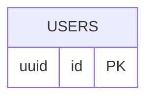
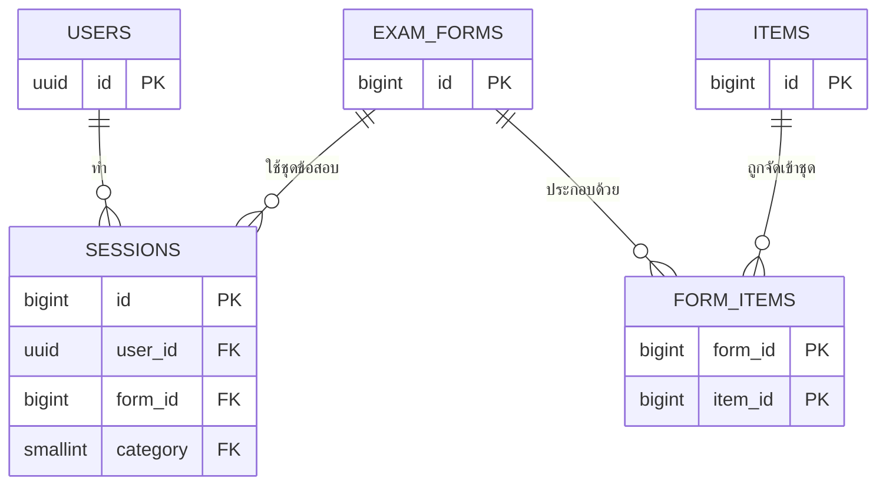
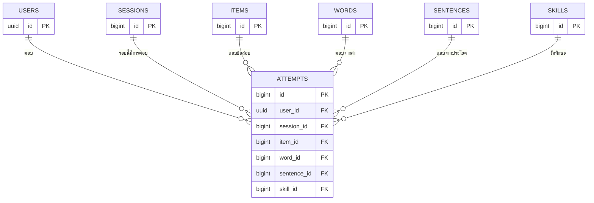
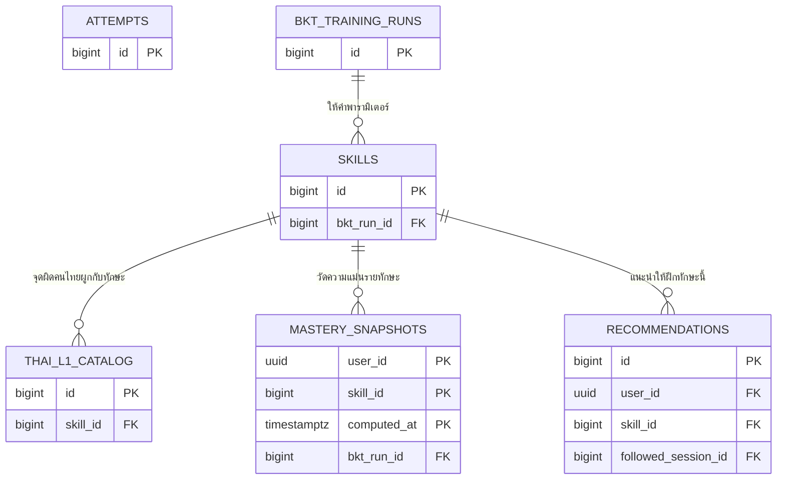
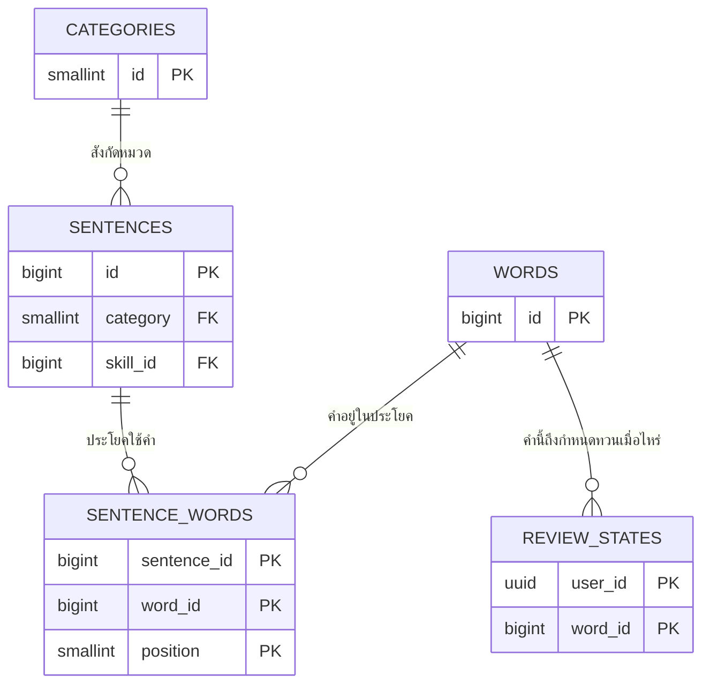
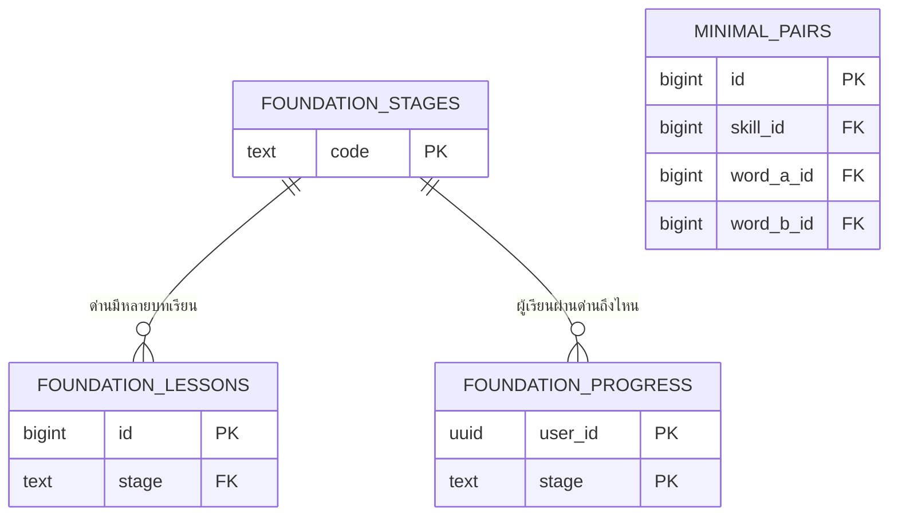

# 🗺️ ER ฉบับย่อ — หัวตาราง + คีย์ (การบ้านอาจารย์ นัดรอบ 5)

> **โจทย์จากอาจารย์ (24 ส.ค. 2026):** *"ผังเต็มเส้นก่ายกันดูยาก — ทำฉบับย่อ หัวตาราง + คีย์ (PK/FK) เท่านั้น ไว้ใช้อธิบายตอนสอบ"*
> และ *"ไม่ได้สิ ต้องไปด้วยกันทั้งคู่"* — **ทั้งบอลและหฤทัยต้องอธิบายได้ทั้งผัง**
>
> วิธีทำความเข้าใจที่อาจารย์สอน: **ไล่ตามกระบวนการผู้ใช้** ไม่ใช่ท่องทีละตาราง → ไฟล์นี้จึงเรียงตามการเดินของผู้เรียน
>
> รายละเอียดเต็มทุกคอลัมน์อยู่ที่ [`DATABASE-ER.md`](DATABASE-ER.md) (แหล่งจริง) · ไฟล์นี้คือ **ฉบับพกไปคุย** ตัดคอลัมน์ออกหมด เหลือแต่ชื่อตารางกับคีย์
>
> 🖼️ **ต้องการรูปไปใส่เล่ม/โปสเตอร์ → เปิด [`ER-ฉบับย่อ-星航.drawio`](ER-ฉบับย่อ-星航.drawio) ใน draw.io** — มี **7 หน้า** ดูแท็บล่างจอ (ภาพรวม 1 + เดินตามผู้ใช้ 6 ก้าว ตรงกับหัวข้อในไฟล์นี้)
> ไฟล์นั้นสร้างอัตโนมัติจาก `er-drawio.sql` ตัวเดียวกับผังเต็ม — ไม่มีทางขัดกันเอง
> สร้างใหม่เมื่อ schema เปลี่ยน: `python scripts/gen_er_diagrams.py --slim`
> (จัดตำแหน่งกล่องเองได้ตามใจ แต่ถ้ารันสร้างใหม่ เลย์เอาต์ที่จัดเองจะถูกทับ — จัดหลังรันเสมอ)
>
> **ใช้หน้าไหนตอนไหน:** อธิบายหน้าห้อง/ซ้อมตอบ → ใช้หน้าก้าวที่ 1-6 ทีละหน้า (หน้าละไม่กี่กล่อง เส้นแทบไม่ตัดกัน) · ใส่เล่มหรือโปสเตอร์ → ใช้หน้า "ภาพรวมทั้งระบบ"

---

## 🔑 อ่านผังยังไง — 3 คำที่ต้องรู้ก่อน

| คำ | แปลเป็นภาษาคน | ตัวอย่างจากผังเรา |
|---|---|---|
| **PK** (คีย์หลัก) | เลขประจำตัวของแถวนี้ ห้ามซ้ำ ห้ามว่าง | `words.id` = เลขประจำตัวคำศัพท์ |
| **FK** (คีย์นอก) | เลขที่ **ยืมมาจากตารางอื่น** เพื่อชี้ว่า "แถวนี้เป็นของใคร / ของอะไร" | `attempts.user_id` ชี้ว่าการตอบนี้เป็นของใคร |
| **PK ผสม** | ใช้หลายคอลัมน์รวมกันเป็นเลขประจำตัว | `review_states(user_id, word_id)` = "คนนี้ + คำนี้" มีได้แถวเดียว |

**เคล็ดตอบกรรมการ:** ถ้าถูกถามว่าตารางนี้เกี่ยวกับตารางไหน ให้ดูที่ FK เสมอ — **FK ชี้ไปทางไหน = เกี่ยวกับตารางนั้น**

---

## 🚶 ส่วนที่ 1 · เดินตามกระบวนการผู้ใช้ (ส่วนที่ใช้ท่อง)

เดิน 6 ก้าวตามชีวิตจริงของ "มิ้นท์" ผู้เรียนพื้นศูนย์ · แต่ละก้าวใช้ตารางไม่กี่ตัว

### ก้าวที่ 1 · มิ้นท์สมัครใช้งาน

เกิด **1 แถว** ใน `users` · `id` ของแถวนี้จะถูกยืมไปเป็น FK แทบทุกตารางฝั่งประวัติ

> **เล่าว่า:** "ทุกอย่างที่ผู้เรียนทำ สุดท้ายผูกกลับมาที่ `users.id` แถวเดียวนี้ครับ"

### ก้าวที่ 2 · ทำแบบทดสอบก่อนเรียน

- `sessions` = **1 แถวต่อ 1 รอบการทำ** — แบบทดสอบก่อนเรียน / ควิซ / สอบจำลอง ใช้ตารางเดียวกัน แยกด้วยคอลัมน์ `kind`
- `exam_forms` = **ชุดข้อสอบ** · `form_items` = ตารางกลางที่บอกว่าชุดนี้มีข้อไหนบ้าง
- **ทำไมต้องมี `form_items`:** ข้อสอบ 1 ข้ออยู่ได้หลายชุด และชุด 1 ชุดมีหลายข้อ = **หลายต่อหลาย** ลากเส้นตรงไม่ได้ ต้องมีตารางคั่น

> **คำถามที่อาจารย์โยนมาแล้ว:** *"pre กับ post ต้องเชื่อมคลังข้อสอบชุดเดียวกัน"*
> **ตอบ:** ใช้ `sessions.form_id` ชี้ `exam_forms` ตัวเดียวกันทั้งสองรอบ ตามข้อเสนอ PL-09 ครับ *(⚠️ PL-09 สถานะยัง 🔧 รอยืนยันอาจารย์ — ตอนเล่าให้พูดว่า "แนวทางที่เสนอ" อย่าพูดว่า "มติ" จนกว่าอาจารย์รับ)*

### ก้าวที่ 3 · มิ้นท์ตอบทีละข้อ ⭐ หัวใจของทั้งระบบ

`attempts` = **1 แถวต่อ 1 การตอบ** ตารางที่ใหญ่ที่สุดและสำคัญที่สุด — **ไม่มีตารางนี้ = ไม่มีบทที่ 4 = ไม่มีโครงงาน**

3 อย่างที่ต้องเล่าให้ได้เกี่ยวกับตารางนี้

1. **ทำไมมี FK ชี้ออก 3 ทาง** (`item_id` / `word_id` / `sentence_id`) — กิจกรรมส่วนใหญ่ในแอปวันนี้ทำงานบน **คำ** (บัตรคำ · เกมจับคู่ · ควิซที่ปั้นข้อสด) ไม่ได้อ้างคลังข้อสอบ ถ้าบังคับให้ต้องมี `item_id` ทุกแถว จะบันทึกอะไรไม่ได้เลยจนกว่าคลังข้อสอบจะเสร็จ
2. **ทำไมจด `skill_id` ซ้ำ ทั้งที่ `item_skills` ก็บอกได้** — ข้อที่ปั้นสดไม่มีแถวใน `item_skills` ให้เดิน และการจดไว้ ณ เวลาที่ตอบทำให้ **ข้อมูลทดลองเก่าไม่เปลี่ยนความหมายย้อนหลัง** เมื่อแก้ Q-matrix ทีหลัง
3. **ห้ามแก้ ห้ามลบ** — มันคือชุดข้อมูลที่ใช้เทรนโมเดล ถ้าลบได้ ผลการทดลองพิสูจน์ไม่ได้

### ก้าวที่ 4 · ระบบเริ่มรู้ว่ามิ้นท์อ่อนตรงไหน ⭐ จุดขายของโครงงาน

เส้นทางข้อมูลอ่านว่า: `attempts` สะสม → **pyBKT** คำนวณ → `mastery_snapshots` เก็บค่าความแม่นรายทักษะ → ค่าต่ำ → `recommendations` จ่ายแบบฝึกเจาะ → มิ้นท์กดทำ → บันทึกกลับที่ `recommendations.followed_session_id`

> **ทำไมต้องมี `recommendations`:** ค่า AUC พิสูจน์ได้แค่ว่า *โมเดลทำนายแม่น* — ตารางนี้พิสูจน์ว่า **การวินิจฉัยทำให้ผู้เรียนเปลี่ยนพฤติกรรมจริงไหม** ซึ่งเป็นคนละคำถาม และเป็นคำถามที่เล่มต้องตอบ
>
> **ทำไมต้องมี `bkt_training_runs`:** ระหว่างทดลองเราเทรนหลายรอบ ถ้าเก็บแค่ค่าล่าสุดจะอ้างไม่ได้ว่าตัวเลขในเล่มมาจากรอบไหน ข้อมูลถึงวันไหน กี่คน

### ก้าวที่ 5 · เรียนคำศัพท์ + ระบบนัดทวน

- `review_states` PK ผสม `(user_id, word_id)` = **"คนนี้ + คำนี้" มีได้แถวเดียว** เก็บวันนัดทวนถัดไปตามอัลกอริทึม FSRS
- `sentence_words` PK ผสม 3 คอลัมน์ รวม `position` ด้วย — **`position` คือลำดับคำในประโยค และมันคือเฉลยของแบบฝึกเรียงประโยค**

> **การบ้านภาษาศาสตร์ข้อ 1 ที่อาจารย์สั่ง** (*"ตรวจการเรียงประโยคยังไง"*)
> **ตอบ:** เทียบลำดับที่ผู้เรียนวางกับ `sentence_words.position` ตรง ๆ แบบ rule-based ไม่ใช้ AI เดา ครับ

### ก้าวที่ 6 · บทปูพื้นฐานเสียง

- `foundation_stages` = 4 ด่าน (กติกาภาษาจีน → พินอิน → วรรณยุกต์ → เกมฟังแยกเสียง) · เกณฑ์ผ่าน 80% เก็บเป็น **ข้อมูล** ไม่ใช่เลขฝังในโค้ด
- `minimal_pairs` = คู่เสียงใกล้เคียงที่คนไทยแยกยาก (妈/马) · ชี้ `skill_id` เพื่อบอกว่าคู่นี้ดักจุดผิดข้อไหน

---

## 📋 ส่วนที่ 2 · ตารางทั้งหมด 23 ตัว — "หนึ่งแถว = อะไร"

> วิธีท่องที่ได้ผลที่สุด: **อ่านคอลัมน์ "หนึ่งแถว = อะไร" ให้ขึ้นใจ** ถ้าตอบข้อนี้ได้ จะตอบได้ทุกคำถามที่ตามมา

### 🟦 โซน 1 · คน (1 ตาราง)

| ตาราง | หนึ่งแถว = | PK | FK ชี้ไปไหน |
|---|---|---|---|
| `users` | ผู้ใช้ 1 คน | `id` | — |

### 🟩 โซน 2 · เนื้อหาที่เรียน (7 ตาราง)

| ตาราง | หนึ่งแถว = | PK | FK ชี้ไปไหน |
|---|---|---|---|
| `categories` | หมวดเนื้อหา 1 หมวด (มี 5) | `id` | — |
| `words` | คำศัพท์จีน 1 คำ | `id` | *(`category` ยังเป็นเลขลอย จะเป็น FK ตอน m7-2)* |
| `sentences` | ประโยคตัวอย่าง 1 ประโยค | `id` | `categories`, `skills` |
| `sentence_words` | คำที่ 1 คำ ในประโยคที่ 1 ประโยค ณ ตำแหน่งที่ n | `(sentence_id, word_id, position)` | `sentences`, `words` |
| `foundation_stages` | ด่านปูพื้นเสียง 1 ด่าน (มี 4) | `code` | — |
| `foundation_lessons` | บทเรียน 1 บทในด่านปูพื้น | `id` | `foundation_stages` |
| `minimal_pairs` | คู่เสียงใกล้เคียง 1 คู่ | `id` | `skills`, `words` ×2 |

### 🟨 โซน 3 · ทักษะ — แกนวิชาการ (4 ตาราง)

| ตาราง | หนึ่งแถว = | PK | FK ชี้ไปไหน |
|---|---|---|---|
| `skills` | ทักษะย่อย 1 ตัว | `id` | `bkt_training_runs` |
| `thai_l1_catalog` | จุดผิดเฉพาะคนไทย 1 จุด (มี 15) | `id` | `skills` |
| `item_skills` | **Q-matrix** — ข้อสอบข้อนี้วัดทักษะตัวนี้ | `(item_id, skill_id)` | `items`, `skills` |
| `bkt_training_runs` | การเทรนโมเดล 1 รอบ | `id` | — |

### 🟥 โซน 4 · ข้อสอบ (3 ตาราง)

| ตาราง | หนึ่งแถว = | PK | FK ชี้ไปไหน |
|---|---|---|---|
| `items` | ข้อสอบ 1 ข้อ (นอนอยู่ในคลัง ใช้ซ้ำได้) | `id` | `categories`, `users` ×2 *(คนสร้าง / คนอนุมัติ)* |
| `exam_forms` | ชุดข้อสอบ 1 ชุด | `id` | — |
| `form_items` | ข้อนี้อยู่ในชุดนี้ | `(form_id, item_id)` | `exam_forms`, `items` |

### 🟪 โซน 5 · ประวัติของผู้เรียน (6 ตาราง)

| ตาราง | หนึ่งแถว = | PK | FK ชี้ไปไหน |
|---|---|---|---|
| `sessions` | **1 รอบการทำ** (ควิซ / แบบทดสอบก่อนเรียน / สอบจำลอง / รอบฝึก) | `id` | `users`, `exam_forms`, `categories` |
| `attempts` ⭐ | **1 การตอบ 1 ข้อ** | `id` | `users`, `sessions`, `items`, `words`, `sentences`, `skills` |
| `review_states` | คนนี้ + คำนี้ ถึงกำหนดทวนเมื่อไหร่ | `(user_id, word_id)` | `users`, `words` |
| `mastery_snapshots` | ความแม่นของคนนี้ ในทักษะนี้ ณ เวลานี้ | `(user_id, skill_id, computed_at)` | `users`, `skills`, `bkt_training_runs` |
| `foundation_progress` | คนนี้ผ่านด่านปูพื้นด่านนี้ถึงไหน | `(user_id, stage)` | `users`, `foundation_stages` |
| `recommendations` | คำแนะนำ 1 ชิ้นที่ระบบจ่ายให้คนนี้ | `id` | `users`, `skills`, `sessions` |

### ⬜ โซน 6 · งานหลังบ้าน (2 ตาราง)

| ตาราง | หนึ่งแถว = | PK | FK ชี้ไปไหน |
|---|---|---|---|
| `approval_transfers` | การโอนสิทธิ์อนุมัติ 1 ครั้ง | `id` | `users` ×2 |
| `roadmap_state` | สถานะติ๊กของฟังก์ชัน 1 ตัว | `item_id` | — |

---

## 🎯 ส่วนที่ 3 · ถ้าโดนถามข้อนี้ ให้ชี้ตารางนี้

| คำถาม | ชี้ตารางไหน | ตอบว่า |
|---|---|---|
| ข้อสอบเชื่อมกับคำ / ประโยคยังไง | `attempts` | ผ่าน `attempts` ที่ชี้ได้ทั้ง `item_id` · `word_id` · `sentence_id` เพราะบางกิจกรรมปั้นข้อสดจากคำ ไม่ได้อ้างคลังข้อสอบ |
| pre กับ post ใช้ชุดเดียวกันได้ยังไง | `sessions.form_id` → `exam_forms` | ทั้งสองรอบชี้ `exam_forms` ตัวเดียวกัน · กันข้อรั่วด้วยธง `research_use_only` |
| ตาราง "เรียน" กับ "สอบ" ต่างกันยังไง | `sessions.kind` | ทุกกิจกรรมที่ทำเป็นรอบลง `sessions` ตารางเดียว แยกชนิดด้วย `kind` — เพิ่มชนิดใหม่ = เพิ่มแถว ไม่ต้องแก้โครงตาราง |
| ตารางกลางระหว่างผู้ใช้กับหมวดอยู่ไหน | `sessions` | `sessions` ทำหน้าที่นี้อยู่แล้ว (`user_id` + `category` + `kind`) |
| ระบบรู้ได้ยังไงว่าผู้เรียนอ่อนอะไร | `attempts` → `mastery_snapshots` | สะสม `attempts` เฉพาะ `event_type='graded'` → pyBKT → เก็บผลที่ `mastery_snapshots` |
| ทำไมต้องมีตารางกลาง 3 ตัว | `item_skills` · `form_items` · `sentence_words` | ทั้งสามคือความสัมพันธ์ **หลายต่อหลาย** ลากเส้นตรงไม่ได้ ต้องมีตารางคั่น |
| ตรวจคำตอบใช้ AI ไหม | `sentence_words.position` · `items.answer_key` | ไม่ใช้ · เทียบเฉลยตายตัวด้วย rule ของเราเอง |

---

## ⚠️ จุดที่ยังไม่นิ่ง — ถ้าโดนถามให้ตอบตามจริง

| เรื่อง | สถานะจริง |
|---|---|
| ตารางที่สร้างจริงแล้ว | **2 ตาราง** (`words` · `roadmap_state`) ที่เหลือ 21 ตัวเป็นพิมพ์เขียว รอทำระบบล็อกอิน (m7-1) |
| `words.category` | ยังเป็นเลขลอย ไม่ใช่ FK จริง จะผูกตอน m7-2 |
| FS-04 | สูตรคิวทวนรายวันอ้างค่าที่ถูกตัดทิ้ง 6 ส.ค. → **ยังคำนวณไม่ได้ รอบอลเคาะใหม่** |

## 🔗 เกี่ยวข้อง

[`DATABASE-ER.md`](DATABASE-ER.md) (แหล่งจริง ฉบับเต็ม) · [`ความต้องการข้อมูล-User-Journey.md`](ความต้องการข้อมูล-User-Journey.md) (สคริปต์เดินตามผู้ใช้ ฉบับยาว) · [`er-drawio.sql`](er-drawio.sql) (DDL)
