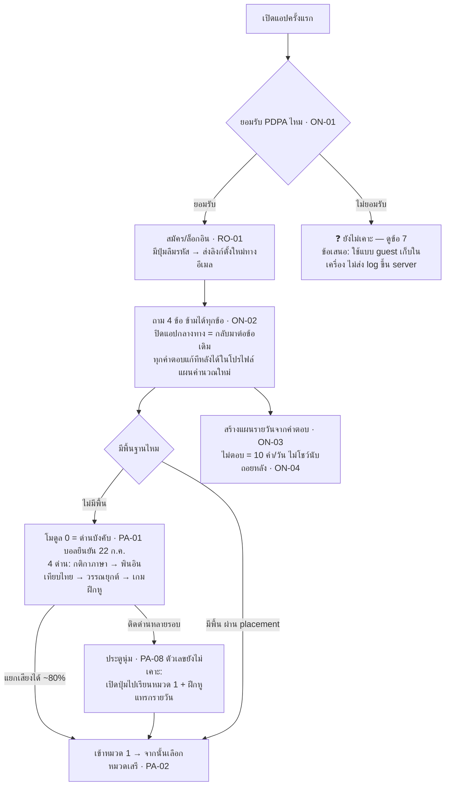
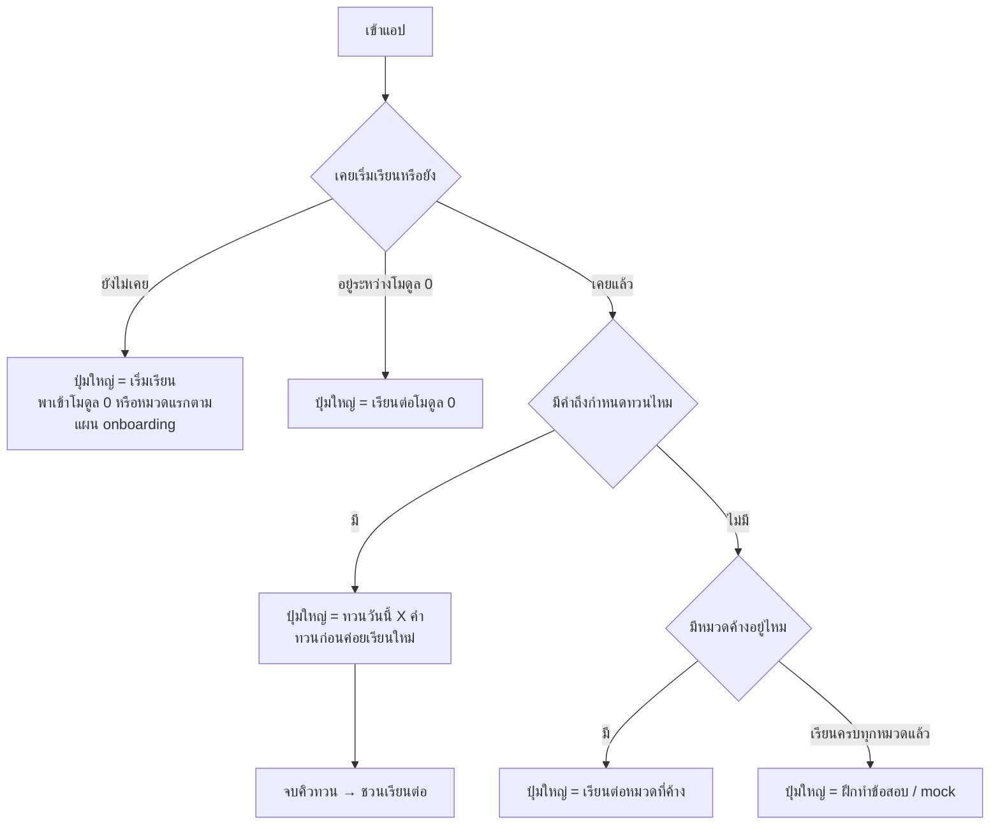
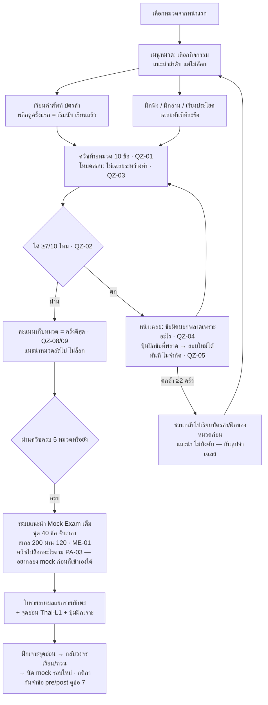
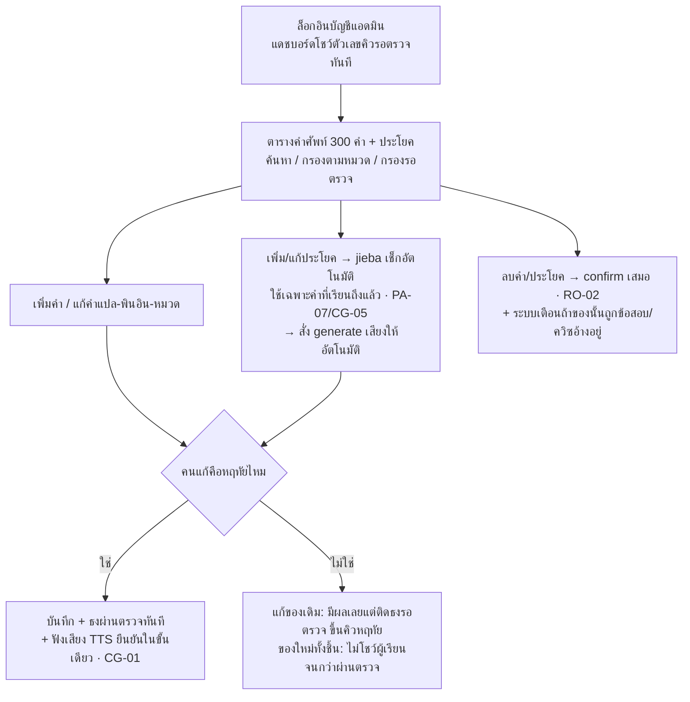
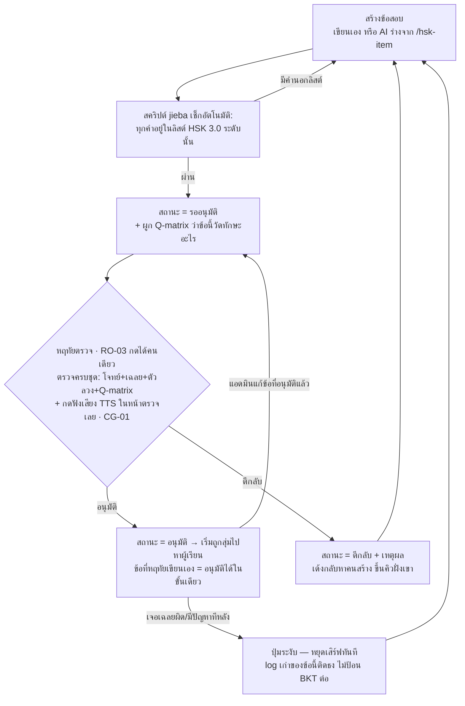

# 🧭 โฟลว์การใช้งาน + สิทธิ์ของแต่ละบทบาท (ผู้เรียน / แอดมิน)

> อัปเดต: 5 ส.ค. 2026 · ยึดกฎจาก `กฎการทำงานระบบ-BUSINESS-RULES.md` (อ้างรหัสกำกับทุกจุด)
> แผนภาพเป็น mermaid — เปิดใน Obsidian หรือ GitHub จะเห็นเป็นผังอัตโนมัติ

---

## 1) บทบาทในระบบ — มี 3 แบบ

| บทบาท | ใคร | สรุปหน้าที่ |
|---|---|---|
| **ผู้เรียน (Member)** | คนไทยเตรียมสอบ HSK 1 | เรียน ฝึก สอบ ดูผลของตัวเอง — แก้อะไรของระบบไม่ได้เลย |
| **แอดมิน** | บอล + หฤทัย (RO-02) | จัดการคำศัพท์ / ประโยค / ข้อสอบ / ติ๊ก roadmap · การลบต้อง confirm เสมอ |
| **ผู้อนุมัติเนื้อหา** | **หฤทัยคนเดียว** (RO-03) | ปุ่ม "อนุมัติข้อสอบ" กดได้เฉพาะบัญชีเธอ — บอลเป็นแอดมินก็กดแทนไม่ได้ |

> ⚠️ สถานะตอนนี้ (ก่อน m7-1): **ยังไม่มีล็อกอิน** — ทุกคนเป็น "ผู้เรียนนิรนาม" ข้อมูลอยู่ในเครื่องตัวเอง (localStorage) · แอดมินแก้ของผ่านสคริปต์/SQL เอา · มีช่องเปิด 2 จุดที่ต้องล็อกทันทีที่ Auth มา: ตาราง `roadmap_state` เขียนได้ทุกคน + endpoint แก้คำแปลไม่มี auth (RO-04)

---

## 2) ตารางสิทธิ์ — ใครทำอะไรได้ (หลังโมดูล 7 เสร็จ)

| การกระทำ | ผู้เรียน | แอดมิน (บอล) | หฤทัย |
|---|:---:|:---:|:---:|
| เรียนบัตรคำ / ฝึก / ควิซ / ทวน / mock | ✅ | ✅ | ✅ |
| ดูผลการเรียน**ของตัวเอง** + ตั้งค่าปริมาณเรียน (ON-06) | ✅ | ✅ | ✅ |
| สมัคร/ล็อกอิน + ยินยอม PDPA ก่อนระบบเก็บ log (ON-01, RO-01) | ✅ | ✅ | ✅ |
| เพิ่ม/แก้/ลบ **คำศัพท์ + หมวด + ประโยค** | ❌ | ✅ | ✅ |
| เพิ่ม/แก้ **ข้อสอบเข้า item bank** (สถานะเริ่ม = รออนุมัติ) | ❌ | ✅ | ✅ |
| **อนุมัติ/ตีกลับข้อสอบ** ก่อนถึงผู้เรียน | ❌ | ❌ | ✅ |
| ยืนยันคำแปล/พินอินที่ถูกแก้ (ธง `th_reviewed`) | ❌ | ❌ | ✅ |
| ติ๊ก roadmap (team-shared) | ❌ | ✅ | ✅ |
| ดู log การตอบรวมทุกคน (วัตถุดิบ BKT) | ❌ | ✅ | ✅ |
| ลบเนื้อหาระบบ (มี confirm เสมอ — RO-02) | ❌ | ✅ | ✅ |
| **ลบบัญชี + ข้อมูลของตัวเอง / ถอนความยินยอม** (สิทธิตาม PDPA — ต้องเขียนวิธีไว้ใน consent ตาม ON-05) | ✅ | ✅ | ✅ |

หลักจำง่าย ๆ: **ผู้เรียนแตะได้แค่ของตัวเอง · แอดมินแตะเนื้อหาได้ · แต่ของที่จะไปโผล่หน้าผู้เรียนเป็น "ข้อสอบ/คำแปล" ต้องผ่านมือหฤทัยเสมอ**

---

## 3) โฟลว์ผู้เรียน

### 3.1 เข้าใช้ครั้งแรก (Onboarding — ON-01..07)



- ตอบ "จะสอบ HSK2" → **เส้นทางเดิม เปลี่ยนแค่เป้า** (แถบคืบหน้านับเทียบ 500 คำ + บอกตรง ๆ ว่าเนื้อหาช่วงนี้คือ HSK1) — ON-07
- ปริมาณเรียนต่อวัน ผู้ใช้เลือกเอง 5/10/15/20 แก้ได้ตลอดในโปรไฟล์ — ON-06 · เกิน ~20 คำ/วัน = เตือนแต่ไม่ห้าม — ON-03
- ตอบมั่วว่า "มีพื้น" แล้วเรียนจริงไม่ไหว → **เข้าโมดูล 0 ได้เสมอ**จากการ์ด "ปูพื้นฐานเสียง" หน้าเลือกหมวด (มีอยู่แล้วบนหน้าแรก)
- ผู้ใช้ยุคก่อนมีล็อกอิน (ข้อมูลใน localStorage): ตอนสมัครครั้งแรก ระบบ**ดูดความคืบหน้าในเครื่องขึ้นบัญชี**ให้อัตโนมัติ — กติกากรณีมีข้อมูลทั้งสองที่ ดูข้อ 7

### 3.2 กลับมาเรียนรายวัน (MO-01)



> โค้ดหน้าแรกปัจจุบันมีกิ่ง "ยังไม่เคย" แล้ว (ปุ่ม "เริ่มเรียน · หมวดแรก") — กิ่ง "อยู่ระหว่างโมดูล 0" จะมีจริงเมื่อโมดูล 0 สร้างเสร็จ

### 3.3 วงจรเรียนในหมวด (PA-10 + QZ)



- ระหว่างทาง ระบบ**ทวนแบบเว้นช่วง**ทำงานเบื้องหลังตลอด: คำที่เรียนแล้วจะโผล่ในคิวทวนตามจังหวะลืม (โมดูล 4)
- ทุกการตอบ (ฝึก+ควิซ+mock) ถูก log รายข้อ → เป็นวัตถุดิบวัดความแม่นรายทักษะ (โมดูล 8)

---

## 4) โฟลว์แอดมิน (โมดูล 7 — ยังไม่ได้สร้าง ให้สร้างตามนี้)

### 4.1 จัดการคำศัพท์/ประโยค (m7-2)



### 4.2 จัดการข้อสอบ + ขั้นอนุมัติ (m7-3 — หัวใจของ item bank)

วงจรชีวิตข้อสอบมี 5 สถานะ: **ร่าง → รออนุมัติ → อนุมัติ → (ตีกลับ) → ระงับ**



**กฎเหล็กของท่อนี้:**
- ข้อสอบที่ไม่ได้อยู่สถานะ "อนุมัติ" **ไม่มีทางโผล่หาผู้เรียน** ไม่ว่ากรณีใด (กติกาทีม + CG) · ตรวจคำตอบด้วยเฉลยตายตัว 100% ห้ามใช้ AI ตรวจ (QZ-07)
- **แก้ข้อที่อนุมัติแล้ว = สถานะเด้งกลับ "รออนุมัติ" อัตโนมัติ** (กันทางลัดข้ามด่านหฤทัย) — ยกเว้นหฤทัยแก้เอง
- ระงับ/ตีกลับจนข้อในหมวด**เหลือน้อยกว่าขั้นต่ำที่สุ่มควิซได้** → ระบบเตือนแอดมินทันที (ตัวเลขขั้นต่ำ ดูข้อ 7)

### 4.3 งานแอดมินอื่น

- **ติ๊ก roadmap** — หลัง Auth มา จำกัดสิทธิ์เขียน `roadmap_state` เฉพาะแอดมิน (ปิดช่อง RO-04)
- **ดู log การตอบรวม** — ไว้เทรน pyBKT + ทำ dashboard จุดอ่อนผู้เรียน (โมดูล 8)
- **จัดการบัญชีตัวเอง** — เปลี่ยนรหัสผ่าน ฯลฯ ตาม Supabase Auth มาตรฐาน

---

## 5) ทางเดินข้อมูลสรุปภาพเดียว

```mermaid
flowchart LR
    subgraph ฝั่งแอดมิน
    A[หฤทัย: เนื้อหา/อนุมัติ] --> C[(คลังคำ + item bank<br/>เฉพาะของที่อนุมัติ)]
    B[บอล: ระบบ/ข้อมูล] --> C
    end
    subgraph ฝั่งผู้เรียน
    C --> D[เรียน/ฝึก/ควิซ/ทวน/mock]
    D --> E[(log การตอบรายข้อ)]
    E --> F[BKT วัดความแม่นรายทักษะ<br/>+ รายงานจุดอ่อน]
    F --> D
    end
    E -.รวมทุกคน.-> B
```

## 6) สิ่งที่ต้องทำเพื่อให้โฟลว์นี้เป็นจริง (ผูกกับ roadmap)

| ลำดับ | งาน | roadmap |
|---|---|---|
| 1 | สมัคร/ล็อกอิน + **หน้าลืมรหัสผ่าน** + ฟอร์ม PDPA (ON-01/05 — ข้อความ consent ยังไม่เขียน ต้องปรึกษาอาจารย์ · ต้องมีวิธีถอนความยินยอม/ลบบัญชี) | m7-1 |
| 2 | Admin จัดการคำศัพท์+ประโยค (ธง th_reviewed ตาม 4.1 + jieba + gen เสียงอัตโนมัติ) | m7-2 |
| 3 | Admin item bank 5 สถานะ + ปุ่มอนุมัติเฉพาะหฤทัย + ปุ่มระงับ + คิวรอตรวจบนแดชบอร์ด | m7-3 |
| 4 | ปิดช่องเปิด 2 จุด (roadmap_state + endpoint แก้คำแปล) | ทำพร้อม m7-1 |
| 5 | Onboarding 4 คำถาม + แผนรายวัน + แก้คำตอบย้อนหลังในโปรไฟล์ | m5-5 |
| 6 | ย้าย progress/log จาก localStorage ขึ้น Supabase ผูกบัญชี (+ ดูดข้อมูลนิรนามตอนสมัคร) | m4-3, m3-2 |

---

## 7) ยังไม่เคาะ — ทีมต้องตัดสิน (จากการสวมบทเดินโฟลว์ 3 บทบาท · 5 ส.ค.)

| # | คำถาม | ข้อเสนอตั้งต้น | ใครเคาะ |
|---|---|---|---|
| 1 | กด "ไม่ยอมรับ PDPA" แล้วเกิดอะไร | ใช้ได้แบบ guest: ข้อมูลอยู่ในเครื่อง ไม่ส่งขึ้น server ไม่ sync — พร้อมแจ้งข้อจำกัดตรง ๆ | บอล + ถามอาจารย์พร้อม ON-05 |
| 2 | ประตูนุ่ม PA-08: "ติดด่านหลายรอบ" = กี่รอบ, ออกไปแล้วต้องกลับมาปิด 80% ไหม | ไม่ผ่านครบ 3 รอบ → เปิดปุ่ม · ไม่บังคับกลับมาปิด แต่แบบฝึกหูแทรกในคิวทวนรายวันจนกว่าจะถึง 80% | บอล |
| 3 | ควิซโดนขัดจังหวะ (สายเข้า/สลับแอป) | ค้าง <10 นาทีกลับมาต่อได้ เกินนั้นทิ้งรอบ (ไม่นับเป็นตก) แต่ข้อที่ตอบแล้ว log ตามจริง | บอล |
| 4 | mock ทำซ้ำได้แค่ไหน + กันจำข้อชุด post | โหมด practice ใช้เฉพาะชุดที่ไม่ใช่ post · ชุด post ล็อกจนถึงวันวัดผล (PL-07/MK-02) | บอล + ตะวัน |
| 5 | ขั้นต่ำข้อสอบต่อหมวดก่อนควิซเปิดสุ่มได้ | 15 ข้อ/หมวด (สุ่ม 10 ไม่ซ้ำหน้ากันเกินไป) — ตัวเลขจริงรอเคาะกับขนาด item bank | ตะวัน |
| 6 | สมัครบัญชีแล้วเจอข้อมูลทั้งในเครื่อง+ในบัญชี | เอาตัวที่ใหม่กว่าเป็นรายคำ (ไม่ใช่ทับทั้งก้อน) | บอล |
| 7 | บัญชีหฤทัยใช้ไม่ได้ (ลืมรหัส/หลุด) ใครอนุมัติแทน | โอนสิทธิ์ชั่วคราวต้องแก้ที่ DB โดยบอล + จดบันทึกการโอนทุกครั้ง | ทีม |
